---
## Front matter
lang: ru-RU
title: "Лаб №1 по дисциплине 

Компьютерный практикум по статистическому анализу данных"
subtitle: Введение в Mininet
author:
  - Шаповалова Диана Дмитриевна
institute:
  - Российский университет дружбы народов, Москва, Россия
date: 14 ноября 2024

## i18n babel
babel-lang: russian
babel-otherlangs: english

## Formatting pdf
toc: false
toc-title: Содержание
slide_level: 2
aspectratio: 169
section-titles: true
theme: metropolis
header-includes:
 - \metroset{progressbar=frametitle,sectionpage=progressbar,numbering=fraction}
---

# Вводная часть

## Цели и задачи

Основной целью работы является развёртывание в системе виртуализации (например, в VirtualBox) mininet, знакомство с основными командами для работы с Mininet через 
командную строку и через графический интерфейс.

# Выполнение лабораторной работы

## Настройка образа VirtualBox

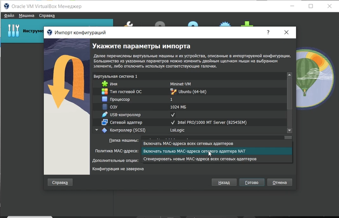{#fig:001 width=100% height=100%}

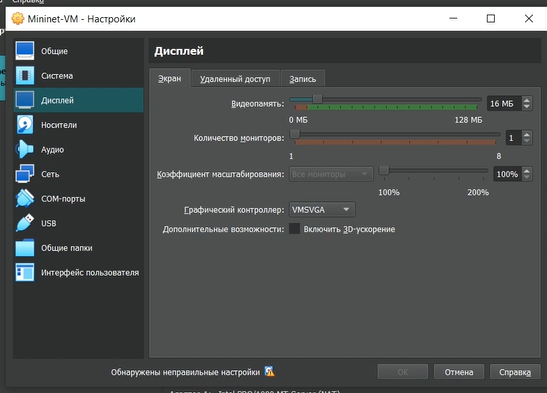{#fig:002 width=100% height=100%}

## Подключение к виртуальной машине

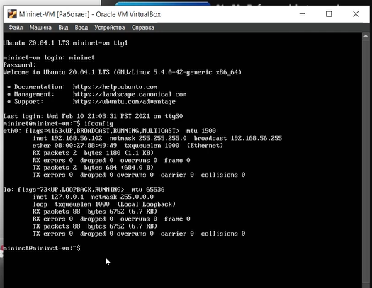{#fig:003 width=100% height=100%}

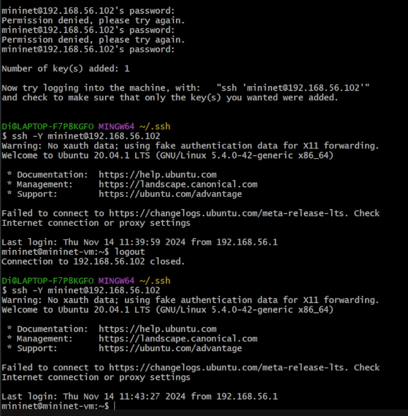{#fig:004 width=100% height=100%}

## Настройка mc

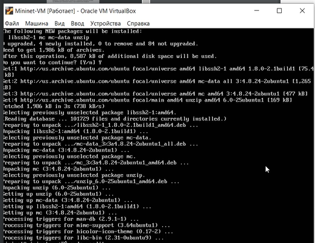{#fig:005 width=100% height=100%}

## Настройка параметров XTerm

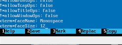{#fig:006 width=100% height=100%}

## Настройка соединения X11 для суперпользователя

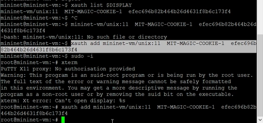{#fig:007 width=100% height=100%}

## Работа с Mininet из-под Windows

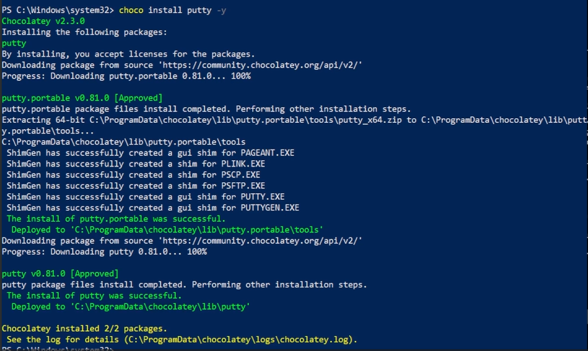{#fig:008 width=100% height=100%}

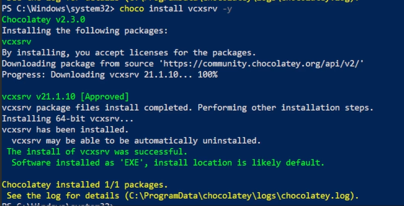{#fig:009 width=100% height=100%}

## Основы работы в Mininet

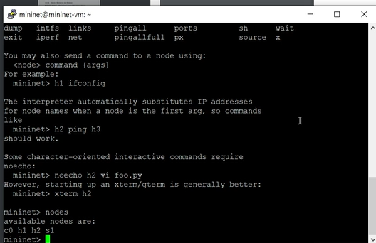{#fig:010 width=100% height=100%}

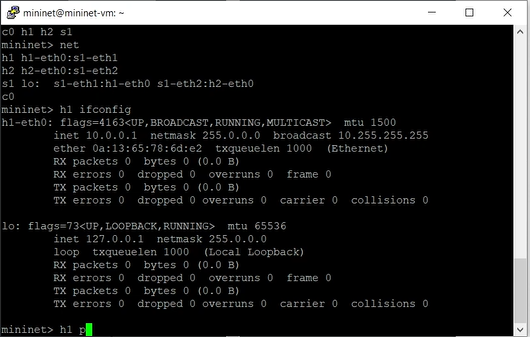{#fig:011 width=100% height=100%}

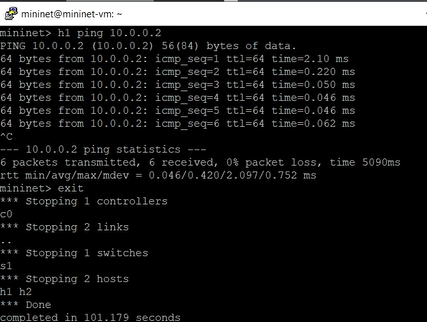{#fig:012 width=100% height=100%}

## Построение и эмуляция сети в Mininet с использованием графического интерфейса

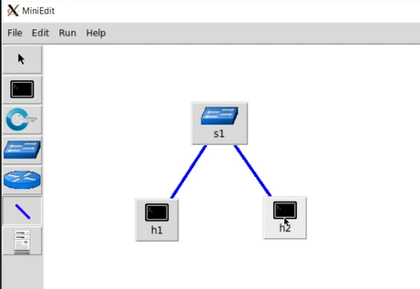{#fig:013 width=100% height=100%}

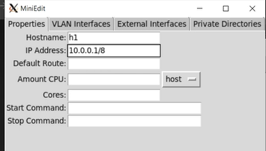{#fig:014 width=100% height=100%}

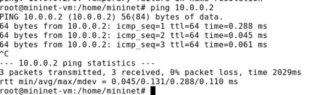{#fig:015 width=100% height=100%}

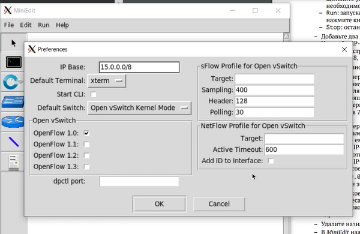{#fig:016 width=100% height=100%}

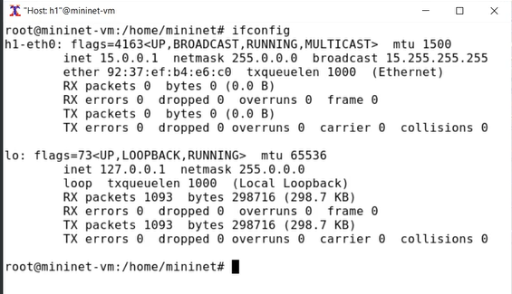{#fig:017 width=100% height=100%}

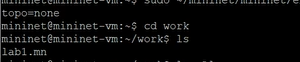{#fig:018 width=100% height=100%}

# Выводы

Мы развернули в системе виртуализации mininet, познакомились с основными командами для работы с Mininet через командную строку и через графический интерфейс.
