---
## Front matter
title: "Отчёт по лабораторной работе №1 по дисциплине 

Компьютерный практикум по статистическому анализу данных"
subtitle: "Введение в Mininet"
author: "Шаповалова Диана Дмитриевна,

НПИбд-02-21, 1032211220"

## Generic otions
lang: ru-RU
toc-title: "Содержание"

## Bibliography
bibliography: bib/cite.bib
csl: pandoc/csl/gost-r-7-0-5-2008-numeric.csl

## Pdf output format
toc: true # Table of contents
toc-depth: 2
lof: true # List of figures
lot: true # List of tables
fontsize: 12pt
linestretch: 1.5
papersize: a4
documentclass: scrreprt
## I18n polyglossia
polyglossia-lang:
  name: russian
  options:
	- spelling=modern
	- babelshorthands=true
polyglossia-otherlangs:
  name: english
## I18n babel
babel-lang: russian
babel-otherlangs: english
## Fonts
mainfont: IBM Plex Serif
romanfont: IBM Plex Serif
sansfont: IBM Plex Sans
monofont: IBM Plex Mono
mathfont: STIX Two Math
mainfontoptions: Ligatures=Common,Ligatures=TeX,Scale=0.94
romanfontoptions: Ligatures=Common,Ligatures=TeX,Scale=0.94
sansfontoptions: Ligatures=Common,Ligatures=TeX,Scale=MatchLowercase,Scale=0.94
monofontoptions: Scale=MatchLowercase,Scale=0.94,FakeStretch=0.9
mathfontoptions:
## Biblatex
biblatex: true
biblio-style: "gost-numeric"
biblatexoptions:
  - parentracker=true
  - backend=biber
  - hyperref=auto
  - language=auto
  - autolang=other*
  - citestyle=gost-numeric
## Pandoc-crossref LaTeX customization
figureTitle: "Рис."
tableTitle: "Таблица"
listingTitle: "Листинг"
lofTitle: "Список иллюстраций"
lotTitle: "Список таблиц"
lolTitle: "Листинги"
## Misc options
indent: true
header-includes:
  - \usepackage{indentfirst}
  - \usepackage{float} # keep figures where there are in the text
  - \floatplacement{figure}{H} # keep figures where there are in the text
---

# Цель работы

Основной целью работы является развёртывание в системе виртуализации (например, в VirtualBox) mininet, знакомство с основными командами для работы с Mininet через 
командную строку и через графический интерфейс.

# Выполнение лабораторной работы
## Настройка образа VirtualBox

– Перейдите в репозиторий Mininet. Скачайте актуальный релиз ovf-образа виртуальной машины.

– При необходимости переместите скачанный образ в каталог для работы, затем распакуйте его.

– Запустите систему виртуализации и импортируйте файл .ovf.

– Перейдите в настройки системы виртуализации и уточните параметры
настройки виртуальной машины. В частности, для VirtualBox выберете импортированную виртуальную машину и перейдите в меню Машина-Настроить. (рис. [-@fig:001] - рис. [-@fig:002]).

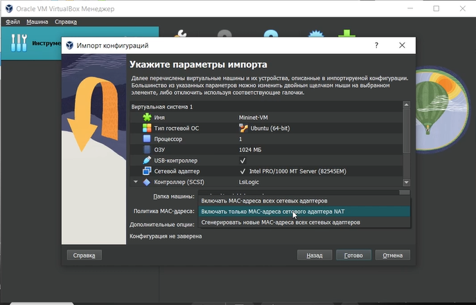{#fig:001 width=100% height=100%}

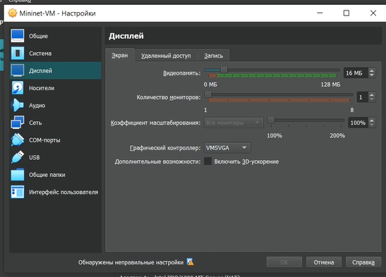{#fig:002 width=100% height=100%}

– Запустите виртуальную машину с Mininet.

## Подключение к виртуальной машине

– Залогиньтесь в виртуальной машине:

– login: mininet

– password: mininet

– Посмотрите адрес машины: ifconfig

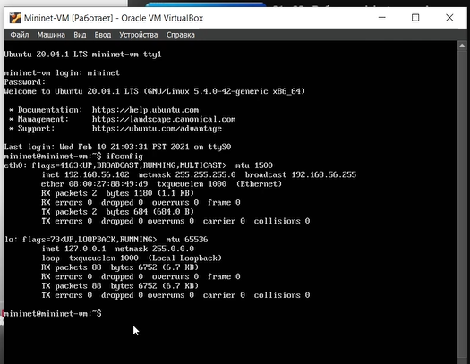{#fig:003 width=100% height=100%}

– Подключитесь к виртуальной машине (из терминала хостовой машины): ssh -Y mininet@192.168.x.y

– Для отключения ssh-соединения с виртуальной машиной нажмите Ctrl + d.

– Настройте ssh-подсоединение по ключу к виртуальной машине, для чего
в терминале основной Linux-машины перейдите в каталог .ssh своего домашнего каталога и введите (вместо 192.168.x.y укажите внутренний адрес
виртуальной машины Mininet): ssh-copy-id mininet@192.168.x.y

– Вновь подключитесь к виртуальной машине и убедитесь, что подсоединение
происходит успешно и без ввода пароля.

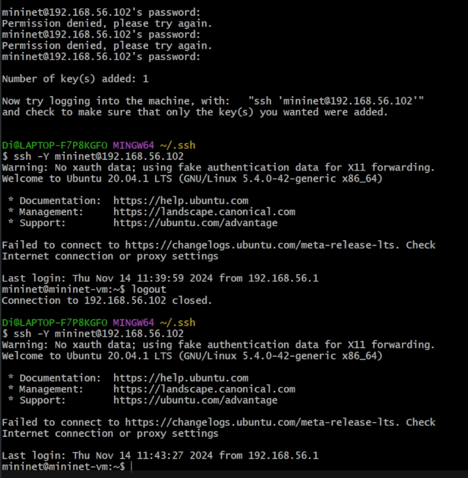{#fig:004 width=100% height=100%}

## Настройка mc

– Для удобства дальнейшей работы установите mc: sudo apt install mc

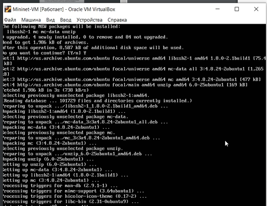{#fig:005 width=100% height=100%}

## Настройка параметров XTerm

По умолчанию XTerm использует растровые шрифты малого кегля. Для увеличения размера шрифта и применения векторных шрифтов вместо растровых
необходимо внести изменения в файл /etc/X11/app-defaults/XTerm. Для
этого можно воспользоваться следующей командой: sudo mcedit /etc/X11/app-defaults/XTerm

и затем в конце файла добавить строки:

xterm*faceName: Monospace

xterm*faceSize: 12

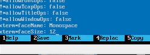{#fig:006 width=100% height=100%}

## Настройка соединения X11 для суперпользователя

При попытке запуска приложения из-под суперпользователя возникает ошибка:

X11 connection rejected because of wrong authentication.

Ошибка возникает из-за того, что X-соединение выполняется от имени пользователя mininet, а приложение запускается от имени пользователя root
с использованием sudo. Для исправления этой ситуации необходимо заполнить файл полномочий /root/.Xauthority, используя утилиту xauth.
Скопируйте значение куки (MIT magic cookie)1 пользователя mininet в файл
для пользователя root

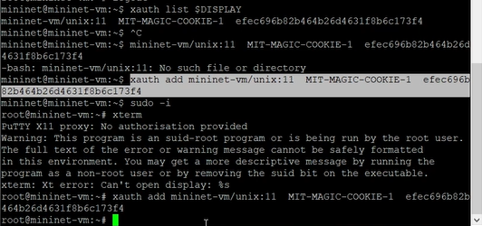{#fig:007 width=100% height=100%}

## Работа с Mininet из-под Windows

– Установите putty: choco install putty

– Установите VcXsrv Windows X Server: choco install vcxsrv

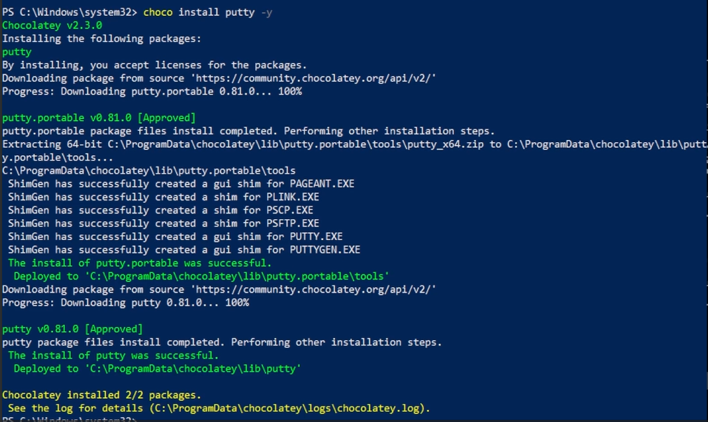{#fig:008 width=100% height=100%}

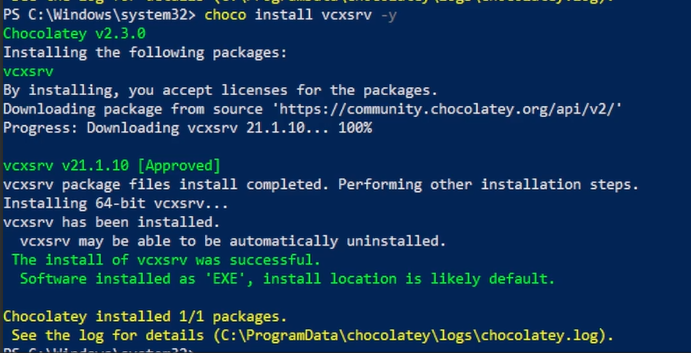{#fig:009 width=100% height=100%}

Запуск Xserver.

– Запустите XLaunch.

– Выберите опции:

– Multiple windows;

– Display number: -1;

– Start no client.

– Можно сохранить параметры, тогда при следующем запуске не нужно будет
отмечать эти опции.

## Основы работы в Mininet

– Для запуска минимальной топологии введите в командной строке: sudo mn

Эта команда запускает Mininet с минимальной топологией, состоящей из
коммутатора, подключённого к двум хостам.

– Для отображения списка команд интерфейса командной строки Mininet
и примеров их использования введите команду в интерфейсе командной
строки Mininet: help

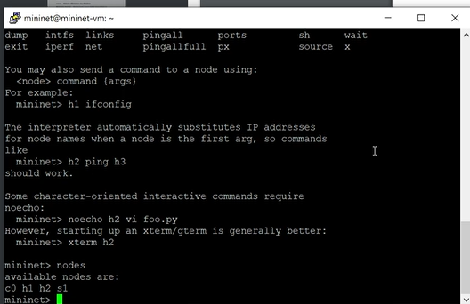{#fig:010 width=100% height=100%}

– Для отображения доступных узлов введите: nodes

Вывод этой команды показывает, что есть два хоста (хост h1 и хост h2)
и коммутатор (s1).

– Иногда бывает полезно отобразить связи между устройствами в Mininet,
чтобы понять топологию. Введите команду net в интерфейсе командной
строки Mininet, чтобы просмотреть доступные линки: net

Вывод этой команды показывает:

– Хост h1 подключён через свой сетевой интерфейс h1-eth0 к коммутатору на интерфейсе s1-eth1.

– Хост h2 подключён через свой сетевой интерфейс h2-eth0 к коммутатору на интерфейсе s1-eth2.

– Коммутатор s1:

– имеет петлевой интерфейс lo.

– подключается к h1-eth0 через интерфейс s1-eth1.

– подключается к h2-eth0 через интерфейс s1-eth2.

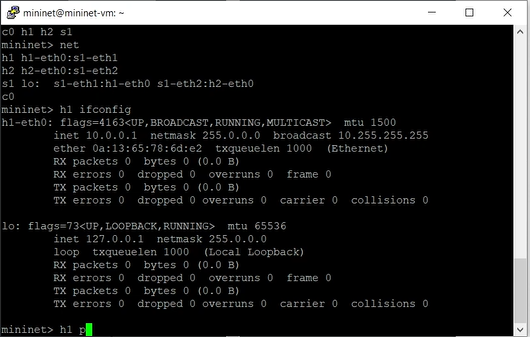{#fig:011 width=100% height=100%}

– Mininet позволяет выполнять команды на конкретном устройстве. Чтобы
выполнить команду для определенного узла, необходимо сначала указать
устройство, а затем команду, например: h1 ifconfig

Эта запись выполняет команду ifconfig на хосте h1 и показывает интерфейсы хоста h1 — хост h1 имеет интерфейс h1-eth0, настроенный
с IP-адресом 10.0.0.1, и другой интерфейс lo, настроенный с IP-адресом
127.0.0.1

Проверка связности.

По умолчанию узлам h1 и h2 назначаются IP-адреса 10.0.0.1/8 и
10.0.0.2/8 соответственно. Чтобы проверить связь между ними, вы можете
использовать команду ping. Команда ping работает, отправляя сообщения
эхо-запроса протокола управляющих сообщений Интернета (ICMP) на удалённый компьютер и ожидая ответа.

Например, команда h1 ping 10.0.0.2
проверяет соединение между хостами h1 и h2. Для остановки теста нажмите
Ctrl + c.

Остановка эмуляции.
Для завершения работы режима эмуляции mininet используйте команду exit

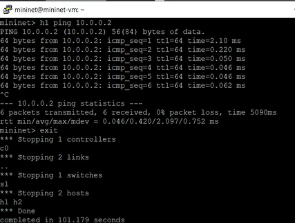{#fig:012 width=100% height=100%}

## Построение и эмуляция сети в Mininet с использованием графического интерфейса

– В терминале виртуальной машины mininet запустите MiniEdit: sudo ~/mininet/mininet/examples/miniedit.py

– Добавьте два хоста и один коммутатор, соедините хосты с коммутатором.

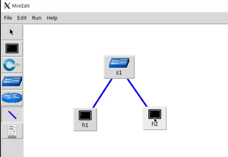{#fig:013 width=100% height=100%}

– Настройте IP-адреса на хостах h1 и h2. Для этого удерживая правую кнопку
мыши на устройстве выберите свойства. Для хоста h1 укажите IP-адрес
10.0.0.1/8, а для хоста h2 — 10.0.0.2/8.

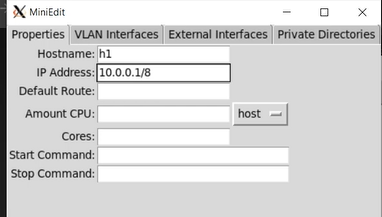{#fig:014 width=100% height=100%}

Проверка связности.

– Перед проверкой соединения между хостом h1 и хостом h2 необходимо
запустить эмуляцию. Для запуска эмуляции нажмите кнопку Run. После
начала эмуляции кнопки панели MiniEdit станут серыми, указывая на то,
что в настоящее время они отключены.

– Откройте терминал на хосте h1, удерживая правую кнопку мыши на хосте
h1 и выбрав Terminal. Это действие позволит выполнять команды на хосте
h1.

– Откройте терминал на хосте h2.

– На терминале хоста h1 введите команду ifconfig, чтобы отобразить назначенные ему IP-адреса. Интерфейс h1-eth0 на хосте h1 должен быть
настроен с IP-адресом 10.0.0.1 и маской подсети 255.0.0.0.

– Повторите эти действия на хосте h2. Его интерфейс h2-eth0 должен быть
настроен с IP-адресом 10.0.0.2 и маской подсети 255.0.0.0.

– Проверьте соединение между хостами, введя в терминале хоста h1 команду
ping 10.0.0.2. Для остановки теста нажмите Ctrl + c.

– Остановите эмуляцию, нажав кнопку Stop.

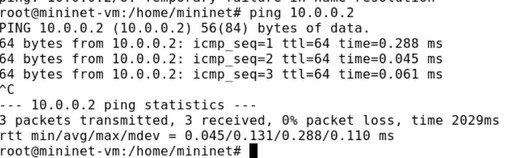{#fig:015 width=100% height=100%}

Автоматическое назначение IP-адресов.

Ранее IP-адреса узлам h1 и h2 были назначены вручную. В качестве альтернативы можно полагаться на Mininet для автоматического назначения
IP-адресов.

– Удалите назначенный вручную IP-адрес с хостов h1 и h2.

– В MiniEdit нажмите Edit Preferences . По умолчанию в поле базовые значения IP-адресов (IP Base) установлено 10.0.0.0/8. Измените это значение
на 15.0.0.0/8.

– Запустите эмуляцию, нажав кнопку Run.

– Откройте терминал на хосте h1, удерживая правую кнопку мыши на хосте
h1 и выбрав Terminal.

– Чтобы отобразить IP-адреса, назначенные хосту h1, введите команду ifconfig

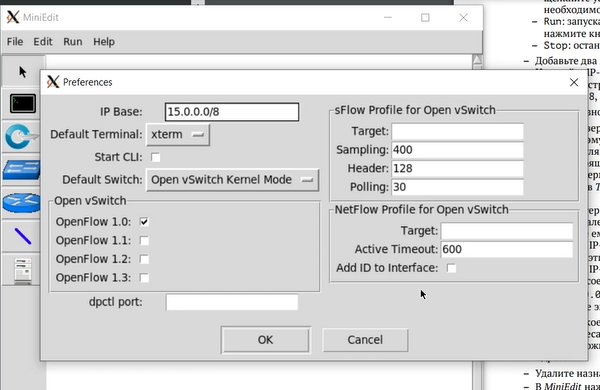{#fig:016 width=100% height=100%}

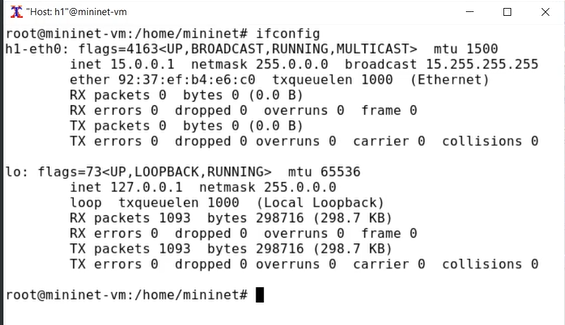{#fig:017 width=100% height=100%}

Интерфейс h1-eth0 на узле h1 теперь имеет IP-адрес 15.0.0.1 и маску
подсети 255.0.0.0.

Сохранение и загрузка топологии Mininet.

– В домашнем каталоге виртуальной машины mininet создайте каталог для
работы с проектами mininet: mkdir ~/work

Для сохранения топологии сети в файл нажмите в MiniEdit File-Save.
Укажите имя для топологии и сохраните на своём компьютере.

– После сохранения проекта поменяйте права доступа к файлам в каталоге
проекта: sudo chown -R mininet:mininet ~/work

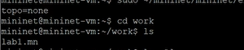{#fig:018 width=100% height=100%}

# Выводы

Мы развернули в системе виртуализации mininet, познакомились с основными командами для работы с Mininet через командную строку и через графический интерфейс.

# Список литературы

[1] Mininet: https://mininet.org/
