---
## Front matter
lang: ru-RU
title: "Лаб №2 по дисциплине Моделирование сетей передачи данных"
subtitle: Измерение и тестирование пропускной способности сети. Интерактивный эксперимент
author:
  - Шаповалова Диана Дмитриевна
institute:
  - Российский университет дружбы народов, Москва, Россия
date: 21 ноября 2024

## i18n babel
babel-lang: russian
babel-otherlangs: english

## Formatting pdf
toc: false
toc-title: Содержание
slide_level: 2
aspectratio: 169
section-titles: true
theme: metropolis
header-includes:
 - \metroset{progressbar=frametitle,sectionpage=progressbar,numbering=fraction}
---

# Вводная часть

## Цели и задачи

Основной целью работы является знакомство с инструментом для измерения
пропускной способности сети в режиме реального времени — iPerf3, а также
получение навыков проведения интерактивного эксперимента по измерению
пропускной способности моделируемой сети в среде Mininet.

# Выполнение лабораторной работы

## 1. Установка необходимого программного обеспечения

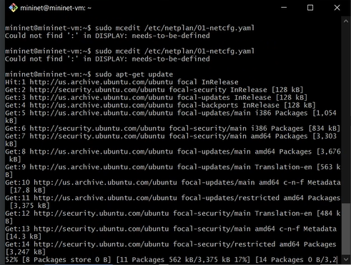{#fig:001 width=100% height=100%}

## 1. Установка необходимого программного обеспечения

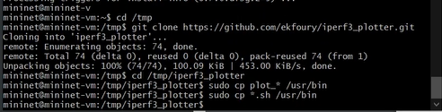{#fig:002 width=100% height=100%}

## 2. Интерактивные эксперименты

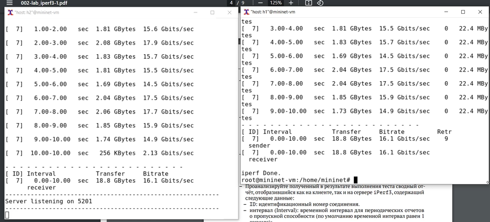{#fig:004 width=100% height=100%}

## 2. Интерактивные эксперименты

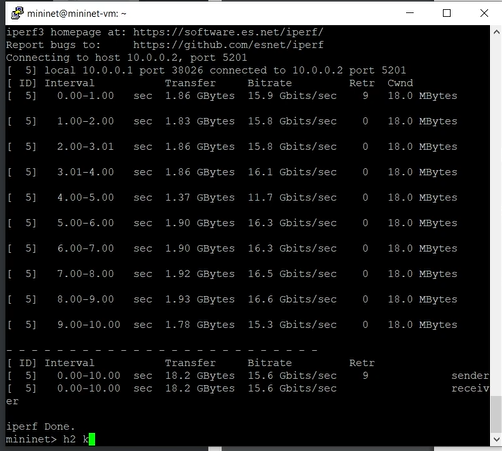{#fig:005 width=100% height=100%}

## 2. Интерактивные эксперименты

[Запусткаем клиент iPerf3 с параметром -t](image/6.png){#fig:006 width=100% height=100%}

## 2. Интерактивные эксперименты

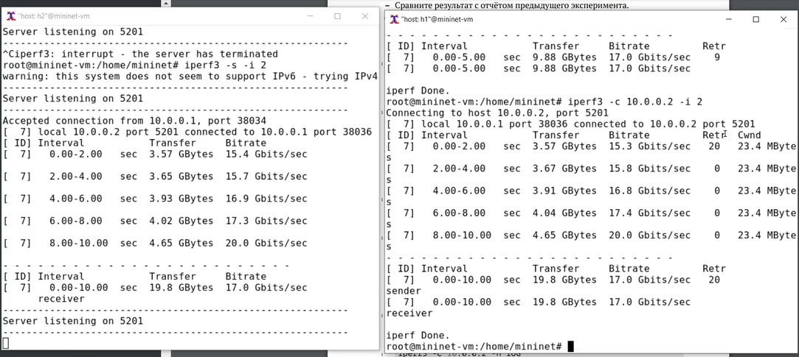{#fig:007 width=100% height=100%}

## 2. Интерактивные эксперименты

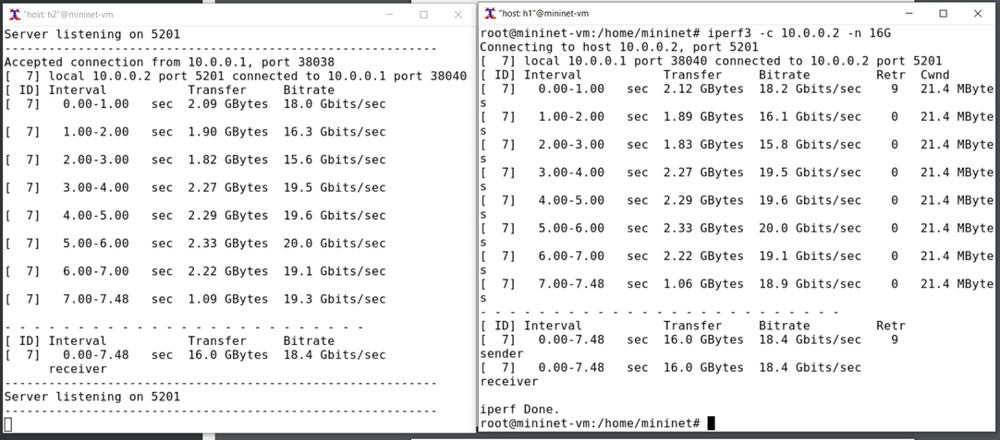{#fig:008 width=100% height=100%}

## 2. Интерактивные эксперименты

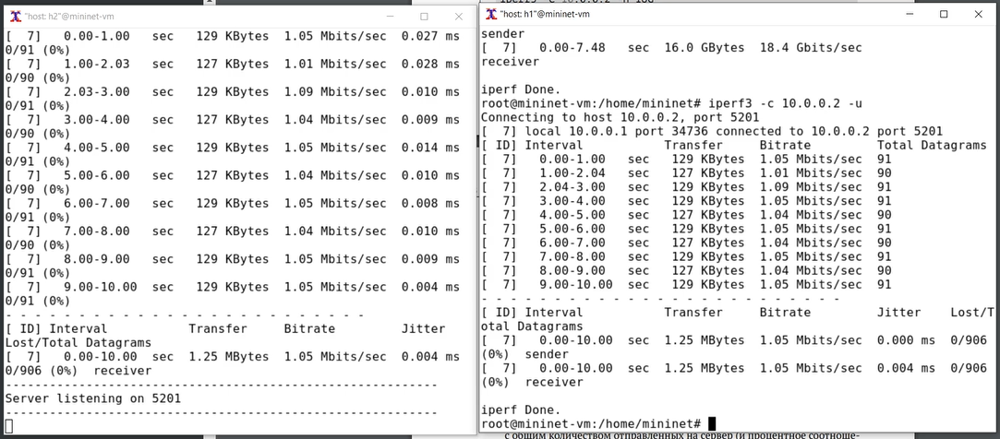{#fig:009 width=100% height=100%}

## 2. Интерактивные эксперименты

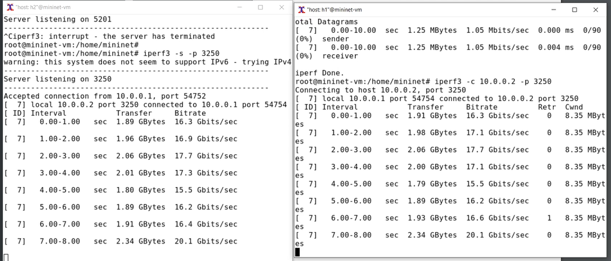{#fig:010 width=100% height=100%}

## 2. Интерактивные эксперименты

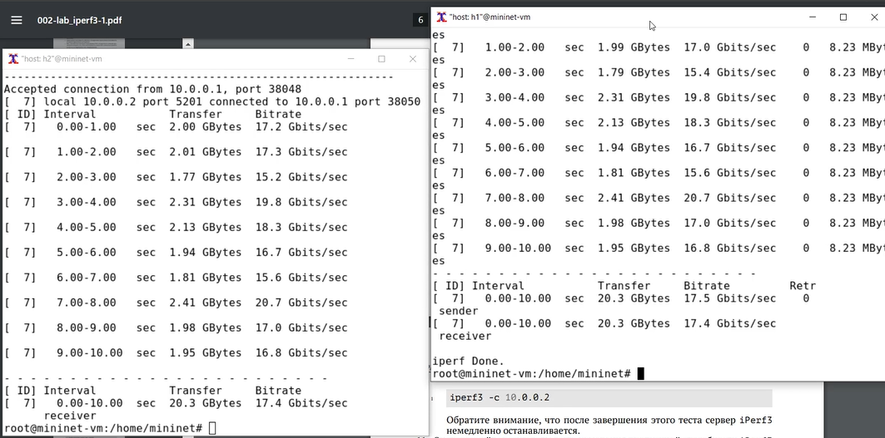{#fig:011 width=100% height=100%}

## 2. Интерактивные эксперименты

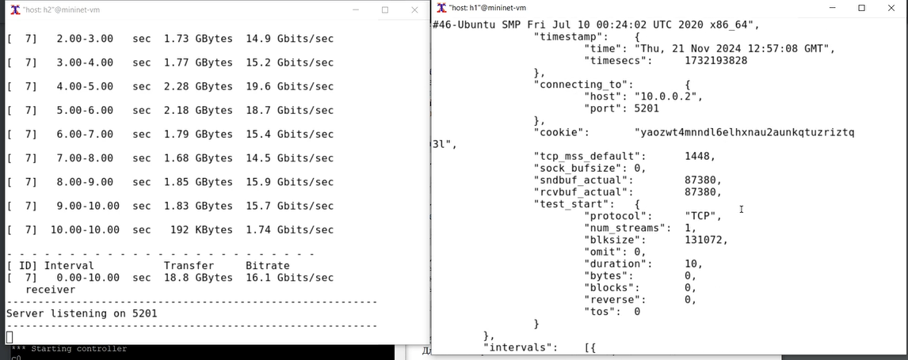{#fig:012 width=100% height=100%}

## 2. Интерактивные эксперименты

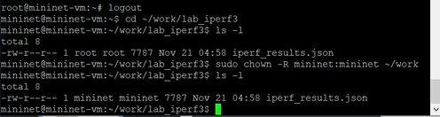{#fig:013 width=100% height=100%}

## 2. Интерактивные эксперименты

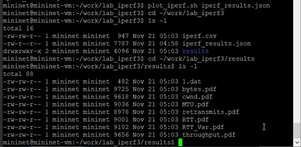{#fig:014 width=100% height=100%}

# Выводы

Мы познакомились с инструментом для измерения пропускной способности сети в режиме реального времени — iPerf3, а также
получили навыки проведения интерактивного эксперимента по измерению пропускной способности моделируемой сети в среде Mininet.
