---
## Front matter
title: "Отчёт по лабораторной работе №2 по дисциплине 

Моделирование сетей передачи данных"
subtitle: "Измерение и тестирование пропускной способности сети.
Интерактивный эксперимент"
author: "Шаповалова Диана Дмитриевна,

НПИбд-02-21, 1032211220"

## Generic otions
lang: ru-RU
toc-title: "Содержание"

## Bibliography
bibliography: bib/cite.bib
csl: pandoc/csl/gost-r-7-0-5-2008-numeric.csl

## Pdf output format
toc: true # Table of contents
toc-depth: 2
lof: true # List of figures
lot: true # List of tables
fontsize: 12pt
linestretch: 1.5
papersize: a4
documentclass: scrreprt
## I18n polyglossia
polyglossia-lang:
  name: russian
  options:
	- spelling=modern
	- babelshorthands=true
polyglossia-otherlangs:
  name: english
## I18n babel
babel-lang: russian
babel-otherlangs: english
## Fonts
mainfont: IBM Plex Serif
romanfont: IBM Plex Serif
sansfont: IBM Plex Sans
monofont: IBM Plex Mono
mathfont: STIX Two Math
mainfontoptions: Ligatures=Common,Ligatures=TeX,Scale=0.94
romanfontoptions: Ligatures=Common,Ligatures=TeX,Scale=0.94
sansfontoptions: Ligatures=Common,Ligatures=TeX,Scale=MatchLowercase,Scale=0.94
monofontoptions: Scale=MatchLowercase,Scale=0.94,FakeStretch=0.9
mathfontoptions:
## Biblatex
biblatex: true
biblio-style: "gost-numeric"
biblatexoptions:
  - parentracker=true
  - backend=biber
  - hyperref=auto
  - language=auto
  - autolang=other*
  - citestyle=gost-numeric
## Pandoc-crossref LaTeX customization
figureTitle: "Рис."
tableTitle: "Таблица"
listingTitle: "Листинг"
lofTitle: "Список иллюстраций"
lotTitle: "Список таблиц"
lolTitle: "Листинги"
## Misc options
indent: true
header-includes:
  - \usepackage{indentfirst}
  - \usepackage{float} # keep figures where there are in the text
  - \floatplacement{figure}{H} # keep figures where there are in the text
---

# Цель работы

Основной целью работы является знакомство с инструментом для измерения
пропускной способности сети в режиме реального времени — iPerf3, а также
получение навыков проведения интерактивного эксперимента по измерению
пропускной способности моделируемой сети в среде Mininet.

# Выполнение лабораторной работы
## 1. Установка необходимого программного обеспечения

Обновите репозитории программного обеспечения на виртуальной машине: sudo apt-get update

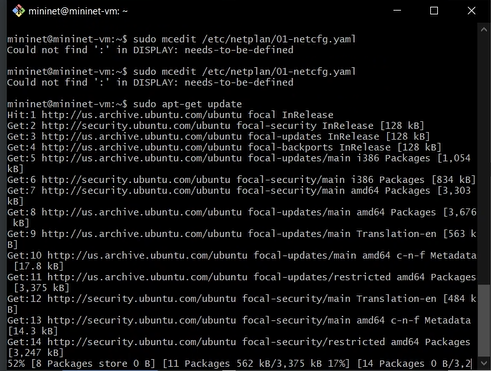{#fig:001 width=100% height=100%}

Установите iperf3: sudo apt-get install iperf3

Установите необходимое дополнительное программное обеспечение на виртуальную машину: sudo apt-get install git jq gnuplot-nox evince

Разверните iperf3_plotter. Для этого:

– перейдите во временный каталог и скачайте репозиторий:

cd /tmp

git clone https://github.com/ekfoury/iperf3_plotter.git

– установите iperf3_plotter:

cd /tmp/iperf3_plotter

sudo cp plot_* /usr/bin

sudo cp *.sh /usr/bin

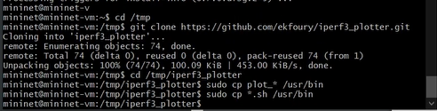{#fig:002 width=100% height=100%}

## 2. Интерактивные эксперименты

Задайте простейшую топологию, состоящую из двух хостов и коммутатора с назначенной по умолчанию mininet сетью 10.0.0.0/8:

sudo mn --topo=single,2 -x

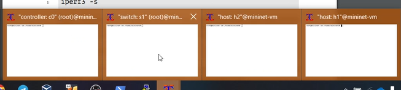{#fig:003 width=100% height=100%}

Проведите простейший интерактивный эксперимент по измерению пропускной способности с помощью iPerf3:

– В терминале h2 запустите сервер iPerf3:

iperf3 -s

После запуска этой команды хост h2 перейдёт в состояние прослушивания 5201-го порта в ожидании входящих подключений.

– В терминале хоста h1 запустите клиент iPerf3:

iperf3 -c 10.0.0.2

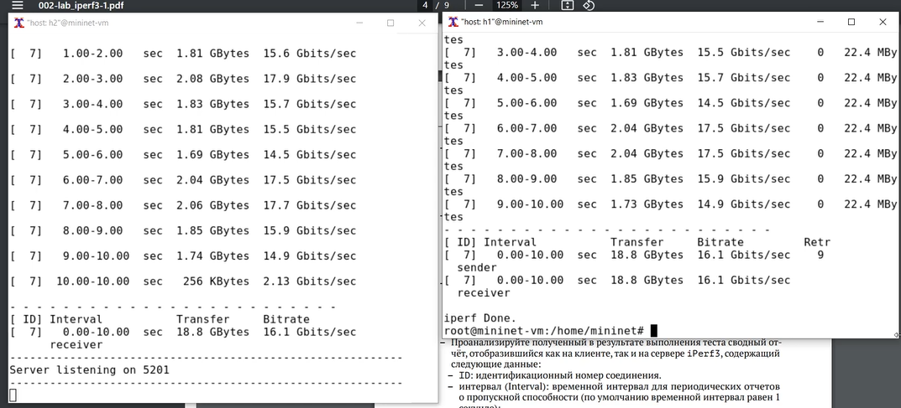{#fig:004 width=100% height=100%}

– Проанализируйте полученный в результате выполнения теста сводный отчёт, отобразившийся как на клиенте, так и на сервере iPerf3, содержащий
следующие данные:

– ID: идентификационный номер соединения.

– интервал (Interval): временной интервал для периодических отчетов
о пропускной способности (по умолчанию временной интервал равен 1 секунде);

– передача (Transfer): сколько данных было передано за каждый интервал
времени;

– пропускная способность (Bitrate): измеренная пропускная способность
в каждом временном интервале;

– Retr: количество повторно переданных TCP-сегментов за каждый временной интервал (это поле увеличивается, когда TCP-сегменты теряются
в сети из-за перегрузки или повреждения);

– Cwnd: указывает размер окна перегрузки в каждом временном интервале (TCP использует эту переменную для ограничения объёма данных,
которые TCP-клиент может отправить до получения подтверждения отправленных данных).

Суммарные данные на сервере аналогичны данным на стороне клиента iPerf3 и должны интерпретироваться таким же образом

Проведите аналогичный эксперимент в интерфейсе mininet.

– Запустите сервер iPerf3 на хосте h2:

1 mininet> h2 iperf3 -s &

– Запустите клиент iPerf3 на хосте h1:

1 mininet> h1 iperf3 -c h2

– Остановите серверный процесс:

1 mininet> h2 killall iperf3

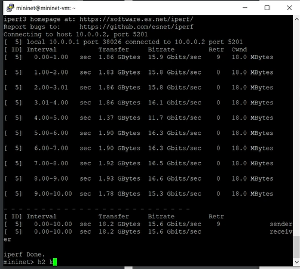{#fig:005 width=100% height=100%}

Для указания iPerf3 периода времени для передачи можно использовать ключ -t (или --time) — время в секундах для передачи (по умолчанию 10
секунд):

– В терминале h2 запустите сервер iPerf3:

iperf3 -s

– В терминале h1 запустите клиент iPerf3 с параметром -t, за которым
следует количество секунд:

iperf3 -c 10.0.0.2 -t 5

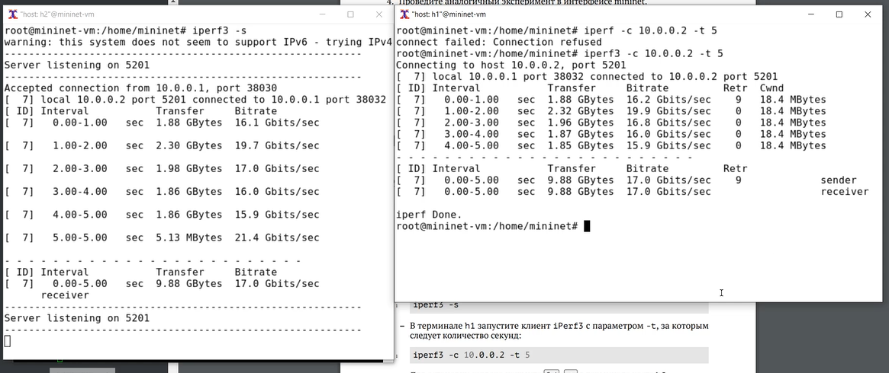{#fig:006 width=100% height=100%}

Настройте клиент iPerf3 для выполнения теста пропускной способности
с 2-секундным интервалом времени отсчёта как на клиенте, так и на сервере.

Используйте опцию -i для установки интервала между отсчётами, измеряемого в секундах:

– В терминале h2 запустите сервер iPerf3:

iperf3 -s -i 2

– В терминале h1 запустите клиент iPerf3:

iperf3 -c 10.0.0.2 -i 2

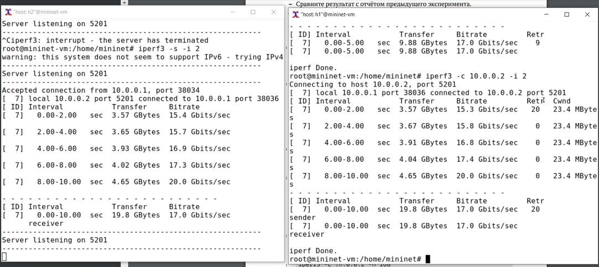{#fig:007 width=100% height=100%}

Задайте на клиенте iPerf3 отправку определённого объёма данных. Используйте опцию -n для установки количества байт для передачи:

– В терминале h2 запустите сервер iPerf3:

iperf3 -s

– В терминале h1 запустите клиент iPerf3, задав объём данных 16 Гбайт:

iperf3 -c 10.0.0.2 -n 16G

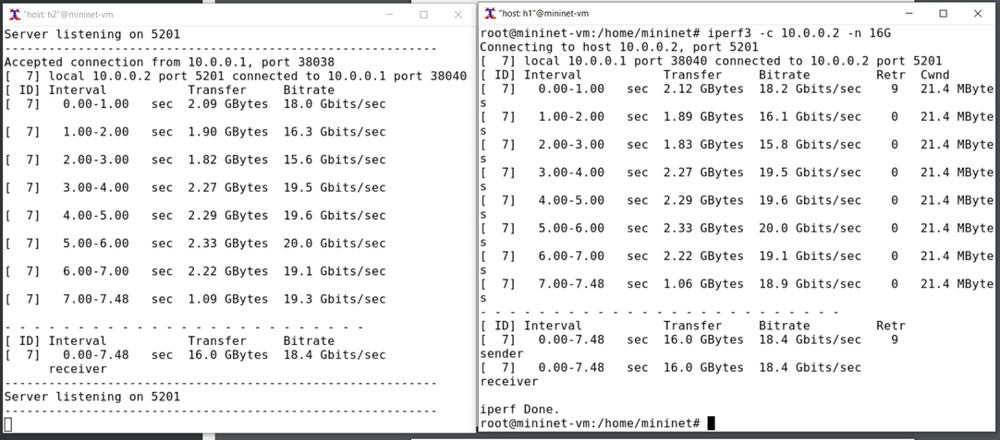{#fig:008 width=100% height=100%}

Измените в тесте измерения пропускной способности iPerf3 протокол передачи данных с TCP (установлен по умолчанию) на UDP. iPerf3 автоматически
определяет протокол транспортного уровня на стороне сервера. Для изменения протокола используйте опцию -u на стороне клиента iPerf3:

– В терминале h2 запустите сервер iPerf3:

iperf3 -s

– В терминале h1 запустите клиент iPerf3, задав протокол UDP:

iperf3 -c 10.0.0.2 -u

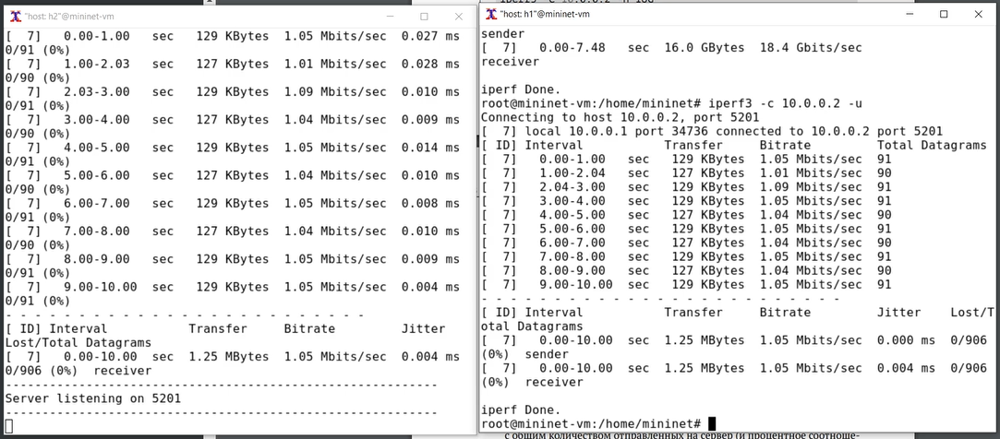{#fig:009 width=100% height=100%}

После завершения теста отобразятся следующие сводные данные:

– ID, интервал, передача, битрейт: то же, что и у TCP.

– Jitter: разница в задержке пакетов.

– Lost/Total: указывает количество потерянных дейтаграмм по сравнению с общим количеством отправленных на сервер (и процентное соотношение).

В тесте измерения пропускной способности iPerf3 измените номер порта для отправки/получения пакетов или датаграмм через указанный порт.
Используйте для этого опцию -p:

– В терминале h2 запустите сервер iPerf3, используя параметр -p, чтобы
указать порт прослушивания:

iperf3 -s -p 3250

– В терминале h1 запустите клиент iPerf3, указав порт:

iperf3 -c 10.0.0.2 -p 3250

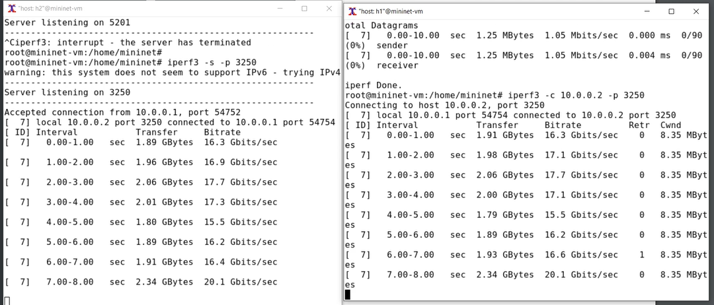{#fig:010 width=100% height=100%}

По умолчанию после запуска сервер iPerf3 постоянно прослушивает входящие соединения. В тесте измерения пропускной способности iPerf3 задайте
для сервера параметр обработки данных только от одного клиента с остановкой сервера по завершении теста. Для этого используйте опцию -1 на
сервере iPerf3:

– В терминале h2 запустите сервер iPerf3, используя параметр -1, чтобы
принять только одного клиента:

iperf3 -s -1

– В терминале h1 запустите клиент iPerf3:

iperf3 -c 10.0.0.2

Обратите внимание, что после завершения этого теста сервер iPerf3 немедленно останавливается.

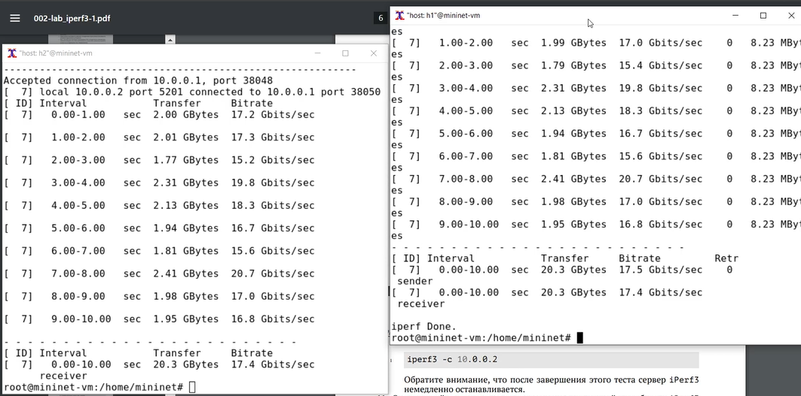{#fig:011 width=100% height=100%}

Экспортируйте результаты теста измерения пропускной способности iPerf3 в файл JSON:

– В виртуальной машине mininet создайте каталог для работы над проектом:

mkdir -p ~/work/lab_iperf3

– В терминале h2 запустите сервер iPerf3:

iperf3 -s

– В терминале h1 запустите клиент iPerf3, указав параметр -J для отображения вывода результатов в формате JSON:

iperf3 -c 10.0.0.2 -J

В данном случае параметр -J выведет текст JSON на экран через стандартный вывод (stdout) после завершения теста.

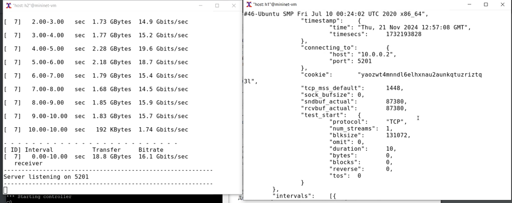{#fig:012 width=100% height=100%}

– Экспортируйте вывод результатов теста в файл, перенаправив стандартный вывод в файл:

iperf3 -c 10.0.0.2 -J > /home/mininet/work/lab_iperf3/iperf_results.json

– Убедитесь, что файл iperf_results.json создан в указанном каталоге.
Для этого в терминале хоста h1 введите следующие команды:

cd /home/mininet/work/lab_iperf3

ls -l

Команда cat может использоваться для отображения содержимого файла.

– Остановите сервер iPerf3, нажав Ctrl+c в терминале хоста h2.

– Завершите работу mininet в интерактивном режиме, введя в интерфейсе mininet:

mininet> exit

– Сгенерируйте выходные данные для файла JSON iPerf3, выполнив следующую команду (обратите внимание, что скрипт не работает с путями,
имеющими в названии файла пробелы):

plot_iperf.sh iperf3_results.json

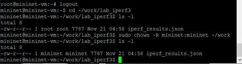{#fig:013 width=100% height=100%}

– Сценарий построения должен создать файл CSV (1.dat), который может
использоваться другими приложениями. В подкаталоге results каталога,
в котором был выполнен скрипт, сценарий должен создать графики для
следующих полей файла JSON:

– окно перегрузки (cwnd.pdf);

– повторная передача (retransmits.pdf);

– время приема-передачи (RTT.pdf);

– отклонение времени приема-передачи (RTT_Var.pdf);

– пропускная способность (throughput.pdf);

– максимальная единица передачи (MTU.pdf);

– количество переданных байтов (bytes.pdf).

– Убедитесь, что файлы с данными и графиками сформировались:

cd ~/work/lab_iperf3

ls -l

cd ~/work/lab_iperf3/results

ls -l

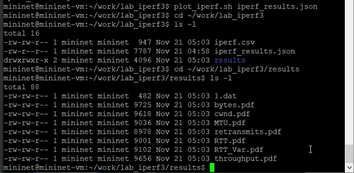{#fig:014 width=100% height=100%}

# Выводы

Мы познакомились с инструментом для измерения пропускной способности сети в режиме реального времени — iPerf3, а также
получили навыки проведения интерактивного эксперимента по измерению пропускной способности моделируемой сети в среде Mininet.

# Список литературы

[1] Mininet: https://mininet.org/

