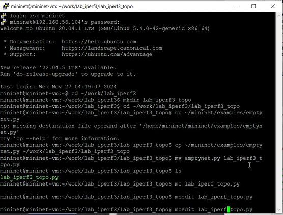
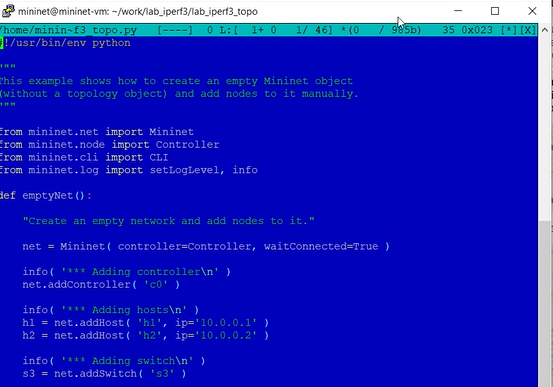
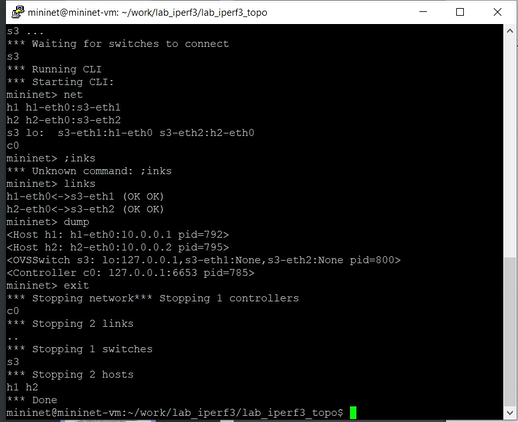
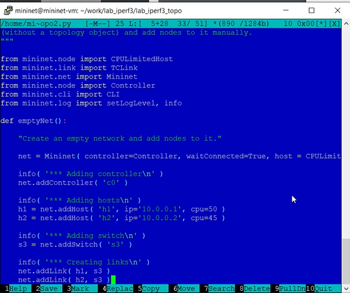
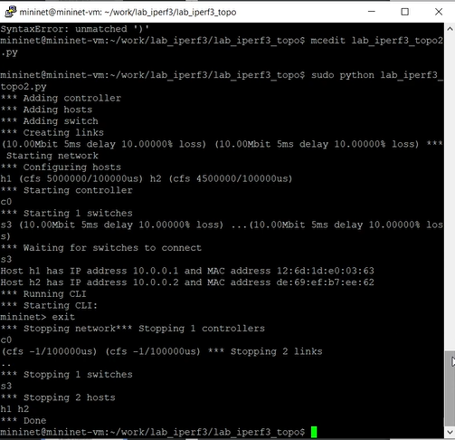
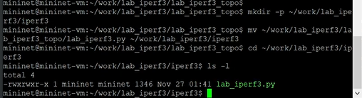
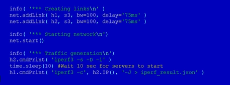
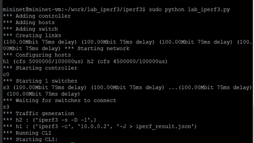
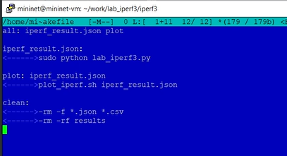
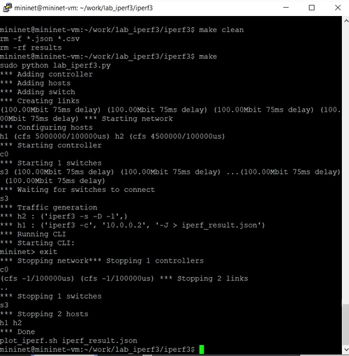

---
## Front matter
lang: ru-RU
title: "Лаб №3 по дисциплине Моделирование сетей передачи данных"
subtitle: Измерение и тестирование пропускной способности сети. Воспроизводимый эксперимент
author:
  - Шаповалова Диана Дмитриевна
institute:
  - Российский университет дружбы народов, Москва, Россия
date: 27 ноября 2024

## i18n babel
babel-lang: russian
babel-otherlangs: english

## Formatting pdf
toc: false
toc-title: Содержание
slide_level: 2
aspectratio: 169
section-titles: true
theme: metropolis
header-includes:
 - \metroset{progressbar=frametitle,sectionpage=progressbar,numbering=fraction}
---

# Вводная часть

## Цели и задачи

Основной целью работы является знакомство с инструментом для измерения
пропускной способности сети в режиме реального времени — iPerf3, а также
получение навыков проведения воспроизводимого эксперимента по измерению
пропускной способности моделируемой сети в среде Mininet.

# Выполнение лабораторной работы

## Выполнение лабораторной работы

{width=100% height=100%}

## Выполнение лабораторной работы

{width=100% height=100%}

## Выполнение лабораторной работы

{width=100% height=100%}

## Выполнение лабораторной работы

.png){width=100% height=100%}

## Выполнение лабораторной работы

{width=100% height=100%}

## Выполнение лабораторной работы

{width=100% height=100%}

## Выполнение лабораторной работы

{width=100% height=100%}

## Выполнение лабораторной работы

{width=100% height=100%}

## Выполнение лабораторной работы

{width=100% height=100%}

## Выполнение лабораторной работы

{width=100% height=100%}

## Выполнение лабораторной работы

{width=100% height=100%}

# Выводы

Мы познакомились с инструментом для измерения пропускной способности сети в режиме реального времени — iPerf3, а также
получили навыки проведения воспроизводимого эксперимента по измерению пропускной способности моделируемой сети в среде Mininet.
