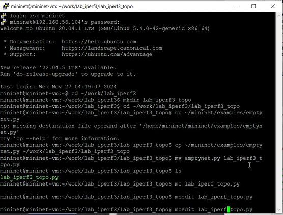
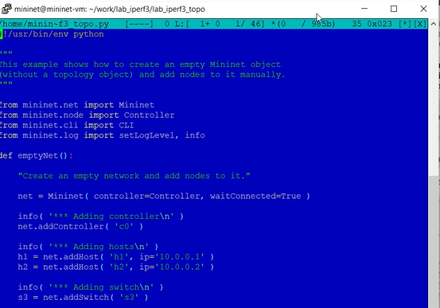
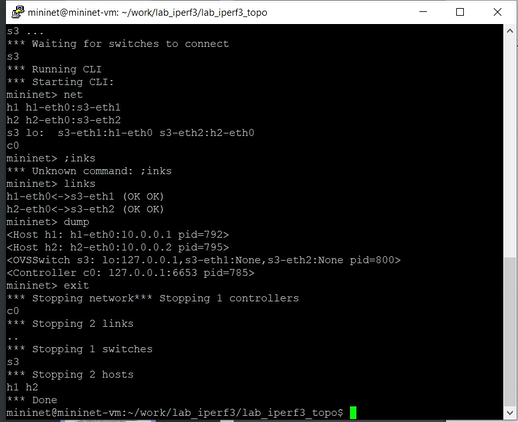
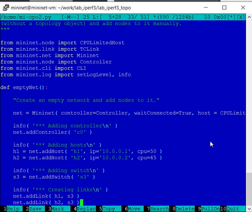
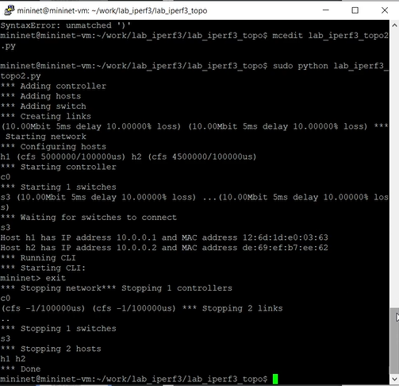
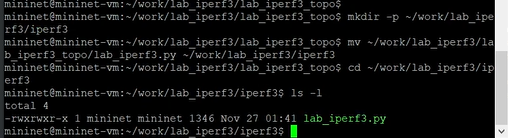
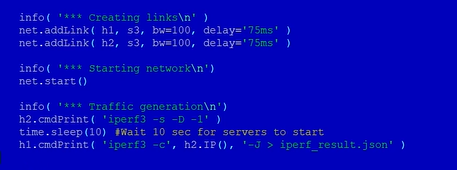
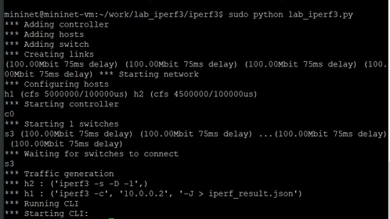
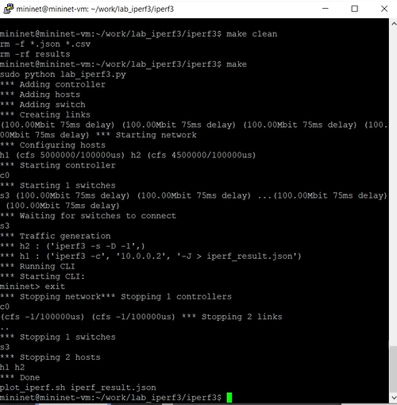

---
## Front matter
title: "Отчёт по лабораторной работе №3 по дисциплине 

Моделирование сетей передачи данных"
subtitle: "Измерение и тестирование пропускной способности сети.
Воспроизводимый эксперимент"
author: "Шаповалова Диана Дмитриевна,

НПИбд-02-21, 1032211220"

## Generic otions
lang: ru-RU
toc-title: "Содержание"

## Bibliography
bibliography: bib/cite.bib
csl: pandoc/csl/gost-r-7-0-5-2008-numeric.csl

## Pdf output format
toc: true # Table of contents
toc-depth: 2
lof: true # List of figures
lot: true # List of tables
fontsize: 12pt
linestretch: 1.5
papersize: a4
documentclass: scrreprt
## I18n polyglossia
polyglossia-lang:
  name: russian
  options:
	- spelling=modern
	- babelshorthands=true
polyglossia-otherlangs:
  name: english
## I18n babel
babel-lang: russian
babel-otherlangs: english
## Fonts
mainfont: IBM Plex Serif
romanfont: IBM Plex Serif
sansfont: IBM Plex Sans
monofont: IBM Plex Mono
mathfont: STIX Two Math
mainfontoptions: Ligatures=Common,Ligatures=TeX,Scale=0.94
romanfontoptions: Ligatures=Common,Ligatures=TeX,Scale=0.94
sansfontoptions: Ligatures=Common,Ligatures=TeX,Scale=MatchLowercase,Scale=0.94
monofontoptions: Scale=MatchLowercase,Scale=0.94,FakeStretch=0.9
mathfontoptions:
## Biblatex
biblatex: true
biblio-style: "gost-numeric"
biblatexoptions:
  - parentracker=true
  - backend=biber
  - hyperref=auto
  - language=auto
  - autolang=other*
  - citestyle=gost-numeric
## Pandoc-crossref LaTeX customization
figureTitle: "Рис."
tableTitle: "Таблица"
listingTitle: "Листинг"
lofTitle: "Список иллюстраций"
lotTitle: "Список таблиц"
lolTitle: "Листинги"
## Misc options
indent: true
header-includes:
  - \usepackage{indentfirst}
  - \usepackage{float} # keep figures where there are in the text
  - \floatplacement{figure}{H} # keep figures where there are in the text
---

# Цель работы

Основной целью работы является знакомство с инструментом для измерения
пропускной способности сети в режиме реального времени — iPerf3, а также
получение навыков проведения воспроизводимого эксперимента по измерению
пропускной способности моделируемой сети в среде Mininet.

# Выполнение лабораторной работы

1. С помощью API Mininet создайте простейшую топологию сети, состоящую
из двух хостов и коммутатора с назначенной по умолчанию mininet сетью
10.0.0.0/8:
   
– В каталоге /work/lab_iperf3 для работы над проектом создайте подкаталог lab_iperf3_topo и скопируйте в него файл с примером скрипта
mininet/examples/emptynet.py, описывающего стандартную простую топологию сети mininet:

{width=100% height=100%}

– Изучите содержание скрипта lab_iperf3_topo.py:

{width=100% height=100%}

Основные элементы:

– addSwitch(): добавляет коммутатор в топологию и возвращает имя коммутатора;

– ddHost(): добавляет хост в топологию и возвращает имя хоста;

– addLink(): добавляет двунаправленную ссылку в топологию (и возвращает ключ ссылки; ссылки в Mininet являются двунаправленными, если
не указано иное);

– Mininet: основной класс для создания и управления сетью;

– start(): запускает сеть;

– pingAll(): проверяет подключение, пытаясь заставить все узлы пинговать друг друга;

– stop(): останавливает сеть;

– net.hosts: все хосты в сети;

– dumpNodeConnections(): сбрасывает подключения к/от набора узлов;

– setLogLevel( 'info' | 'debug' | 'output' ): устанавливает уровень вывода Mininet по умолчанию; рекомендуется info.

Запустите скрипт создания топологии lab_iperf3_topo.py:

sudo python lab_iperf3_topo.py

После отработки скрипта посмотрите элементы топологии и завершите работу mininet:

mininet> net

mininet> links

mininet> dump

mininet> exit

{width=100% height=100%}

2. Внесите в скрипт lab_iperf3_topo.py изменение, позволяющее вывести на экран информацию о хосте h1, а именно имя хоста, его IP-адрес, MACадрес. Для этого после строки, задающей старт работы сети, добавьте строку:

print( "Host", h1.name, "has IP address", h1.IP(), "and MAC address", h1.MAC() )

Здесь:

– IP() возвращает IP-адрес хоста или определенного интерфейса;

– MAC() возвращает MAC-адрес хоста или определенного интерфейса.

3. Проверьте корректность отработки изменённого скрипта.

4. Измените скрипт lab_iperf3_topo.py так, чтобы на экран выводилась информация об имени, IP-адресе и MAC-адресе обоих хостов сети. Проверьте
корректность отработки изменённого скрипта.

.png){width=100% height=100%}

5. Mininet предоставляет функции ограничения производительности и изоляции с помощью классов CPULimitedHost и TCLink. Добавьте в скрипт
настройки параметров производительности:

– Сделайте копию скрипта lab_iperf3_topo.py:

cp lab_iperf3_topo.py lab_iperf3_topo2.py

– В начале скрипта lab_iperf3_topo2.py добавьте записи об импорте классов CPULimitedHost и TCLink:

from mininet.node import CPULimitedHost

from mininet.link import TCLink

– В скрипте lab_iperf3_topo2.py измените строку описания сети, указав
на использование ограничения производительности и изоляции:

net = Mininet( controller=Controller, waitConnected=True, host = CPULimitedHost, link = TCLink )

– В скрипте lab_iperf3_topo2.py измените функцию задания параметров виртуального хоста h1, указав, что ему будет выделено 50% от общих
ресурсов процессора системы:

h1 = net.addHost( 'h1', ip='10.0.0.1', cpu=50 )

– Аналогичным образом для хоста h2 задайте долю выделения ресурсов
процессора в 45%.

– В скрипте lab_iperf3_topo2.py измените функцию параметров соединения между хостом h1 и коммутатором s3:

net.addLink( h1, s3, bw=10, delay='5ms', max_queue_size=1000, loss=10, use_htb=True )

Здесь добавляется двунаправленный канал с характеристиками пропускной способности, задержки и потерь:

– параметр пропускной способности (bw) выражается числом в Мбит;

– задержка (delay) выражается в виде строки с заданными единицами измерения (например, 5ms, 100us, 1s);

– потери (loss) выражаются в процентах (от 0 до 100);

– параметр максимального значения очереди (max_queue_size) выражается в пакетах;

– параметр use_htb указывает на использование ограничителя интенсивности входящего потока Hierarchical Token Bucket (HTB).

{width=100% height=100%}

– Запустите на отработку скрипт lab_iperf3_topo2.py

{width=100% height=100%}

6. Постройте графики по проводимому эксперименту:
   
– Сделайте копию скрипта lab_iperf3_topo2.py и поместите его в подкаталог iperf:

cp lab_iperf3_topo2.py lab_iperf3.py

mkdir -p ~/work/lab_iperf3/iperf3

mv ~/work/lab_iperf3/lab_iperf3_topo/lab_iperf3.py ~/work/lab_iperf3/iperf3

cd ~/work/lab_iperf3/iperf3

ls -l

{width=100% height=100%}

– В начале скрипта lab_iperf3.py добавьте запись

import time

– Измените код в скрипте lab_iperf3.py так, чтобы:

– на хостах не было ограничения по использованию ресурсов процессора;

– каналы между хостами и коммутатором были по 100 Мбит/с с задержкой 75 мс, без потерь, без использования ограничителей пропускной
способности и максимального размера очереди

– После функции старта сети опишите запуск на хосте h2 сервера iPerf3, а на хосте h1 запуск с задержкой в 10 секунд клиента iPerf3 с экспортом
результатов в JSON-файл, закомментируйте строки, отвечающие за запуск CLI-интерфейса

{width=100% height=100%}

– Запустите на отработку скрипт lab_iperf3.py:

sudo python lab_iperf3.py

{width=100% height=100%}

– Постройте графики из получившегося JSON-файла:

plot_iperf.sh iperf_result.json

– Создайте Makefile для проведения всего эксперимента:

touch Makefile

– В Makefile пропишите запуск скрипта эксперимента, построение графиков и очистку каталога от результатов:

{width=100% height=100%}

– Проверьте корректность отработки Makefile:

make clean

make

{width=100% height=100%}

# Выводы

Мы познакомились с инструментом для измерения пропускной способности сети в режиме реального времени — iPerf3, а также
получили навыки проведения воспроизводимого эксперимента по измерению пропускной способности моделируемой сети в среде Mininet.

# Список литературы

[1] Mininet: https://mininet.org/

