---
## Front matter
lang: ru-RU
title: "Лаб №4 по дисциплине Моделирование сетей передачи данных"
subtitle: Эмуляция и измерение задержек в глобальных сетях
author:
  - Шаповалова Диана Дмитриевна
institute:
  - Российский университет дружбы народов, Москва, Россия
date: 5 декабря 2024

## i18n babel
babel-lang: russian
babel-otherlangs: english

## Formatting pdf
toc: false
toc-title: Содержание
slide_level: 2
aspectratio: 169
section-titles: true
theme: metropolis
header-includes:
 - \metroset{progressbar=frametitle,sectionpage=progressbar,numbering=fraction}
---

# Вводная часть

## Цели и задачи

Основной целью работы является знакомство с NETEM — инструментом для
тестирования производительности приложений в виртуальной сети, а также
получение навыков проведения интерактивного и воспроизводимого экспериментов по измерению задержки и её дрожания (jitter) в моделируемой сети в среде Mininet.

# Выполнение работы
## Запуск лабораторной топологии

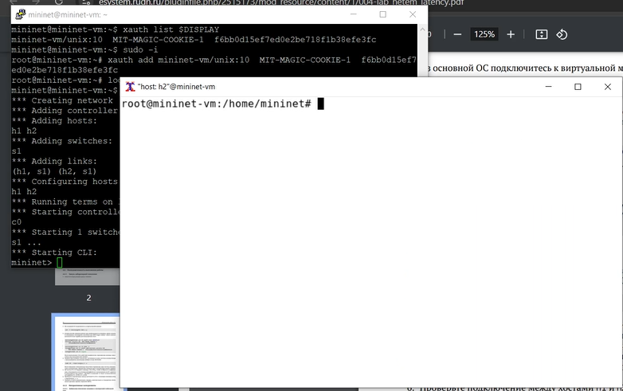{width=100% height=100%}

## Интерактивные эксперименты. Добавление/изменение задержки в эмулируемой глобальной сети

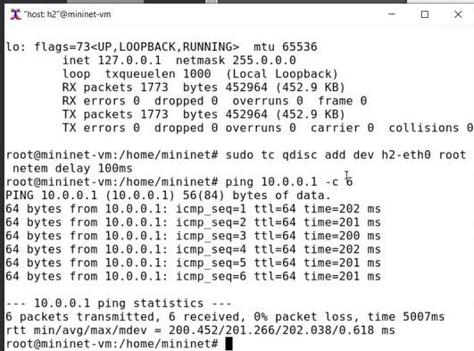{width=100% height=100%}

## Изменение задержки в эмулируемой глобальной сети

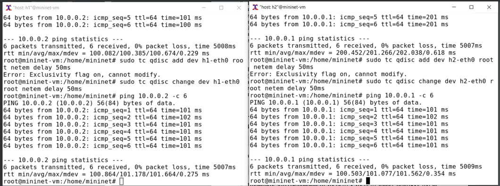{width=100% height=100%}

## Восстановление исходных значений (удаление правил) задержки в эмулируемой глобальной сети

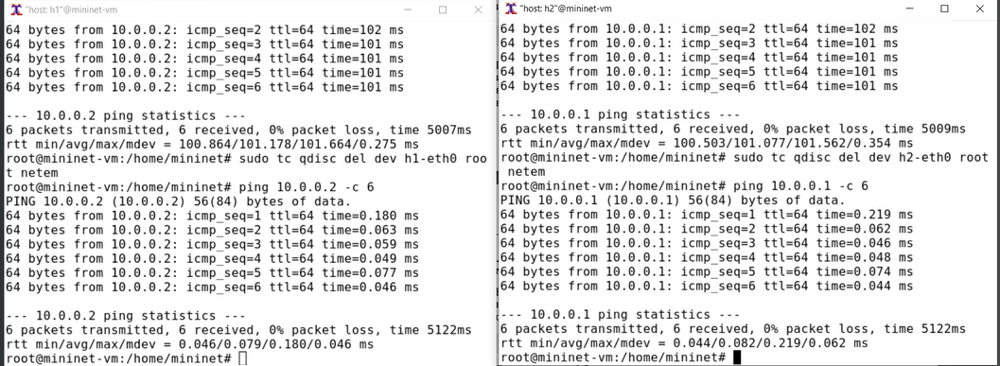{width=100% height=100%}

## Добавление значения дрожания задержки в интерфейс подключения к эмулируемой глобальной сети

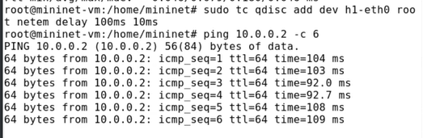{width=100% height=100%}

## Добавление значения корреляции для джиттера и задержки в интерфейс подключения к эмулируемой глобальной сети

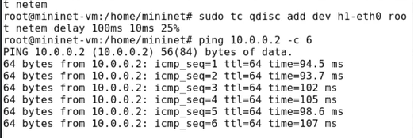{width=100% height=100%}

## Распределение задержки в интерфейсе подключения к эмулируемой глобальной сети

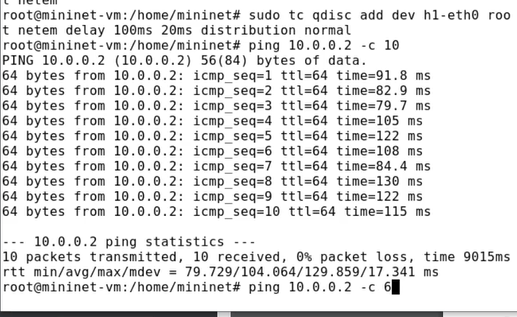{width=100% height=100%}

## Воспроизведение экспериментов. Предварительная подготовка

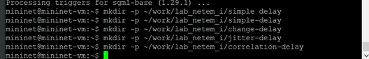{width=100% height=100%}

## Добавление задержки для интерфейса, подключающегося к эмулируемой глобальной сети

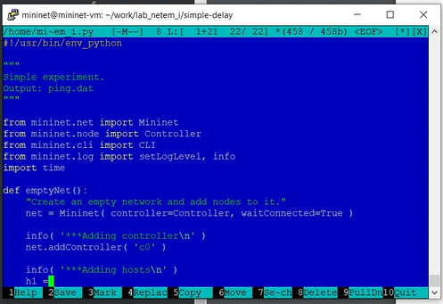{width=100% height=100%}

## Добавление задержки для интерфейса, подключающегося к эмулируемой глобальной сети

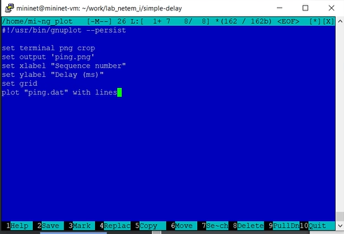{width=100% height=100%}

## Добавление задержки для интерфейса, подключающегося к эмулируемой глобальной сети

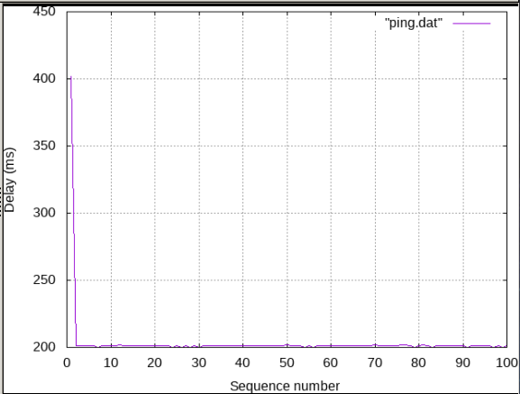{width=100% height=100%}

## Добавление задержки для интерфейса, подключающегося к эмулируемой глобальной сети

.png){width=100% height=100%}

# Задание для самостоятельной работы

## Эксперимент по изменению задержки

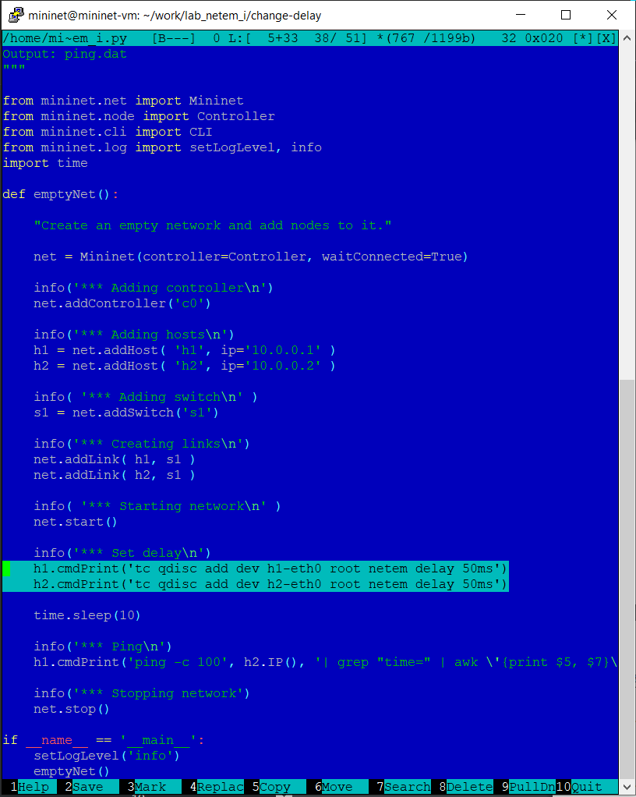{width=100% height=100%}

## Эксперимент по изменению задержки

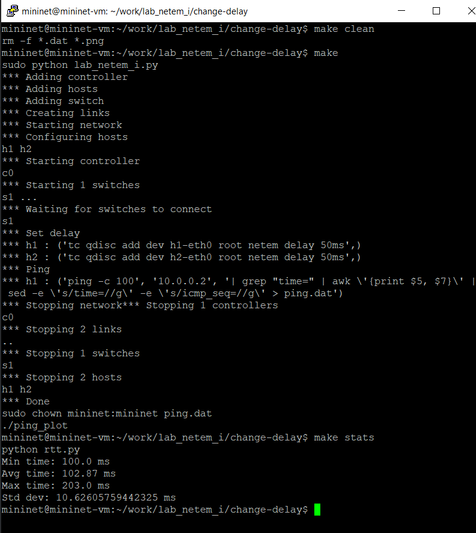{width=100% height=100%}

## Эксперимент по изменению задержки

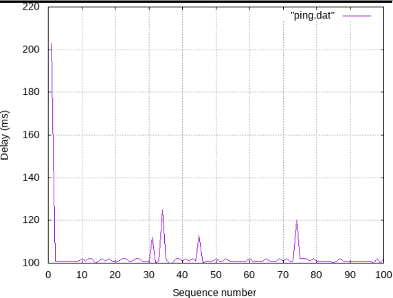{width=100% height=100%}

## Эксперимент по изменению джиттера

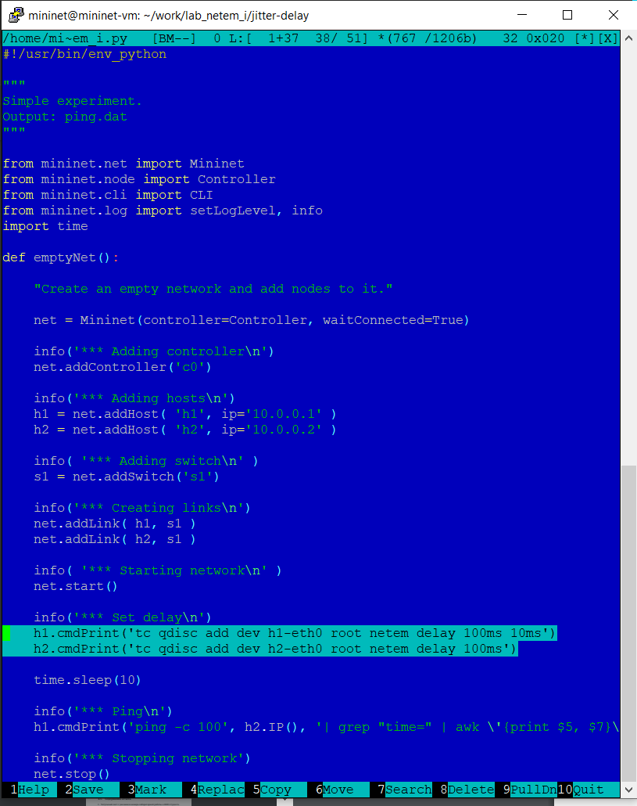{width=100% height=100%}

## Эксперимент по изменению джиттера

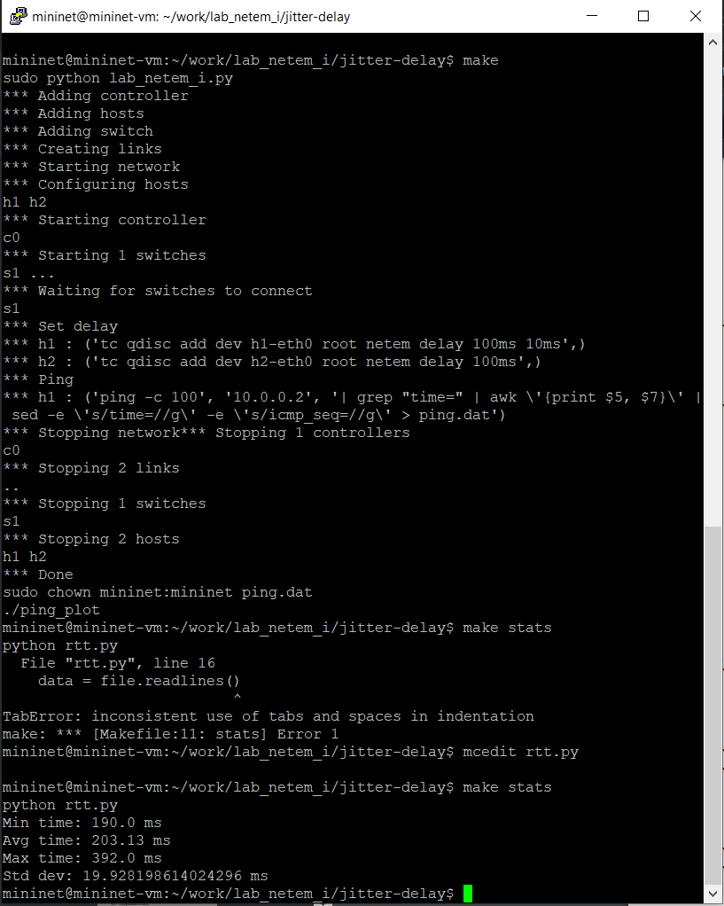{width=100% height=100%}

## Эксперимент по изменению джиттера

{width=100% height=100%}

## Эксперимент по изменению значения корреляции для джиттера и задержки

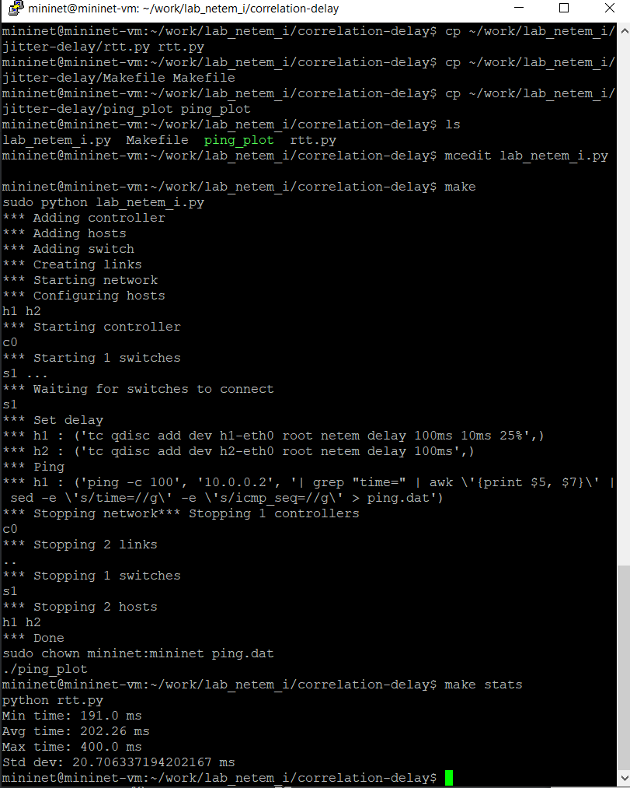{width=100% height=100%}

## Эксперимент по изменению значения корреляции для джиттера и задержки

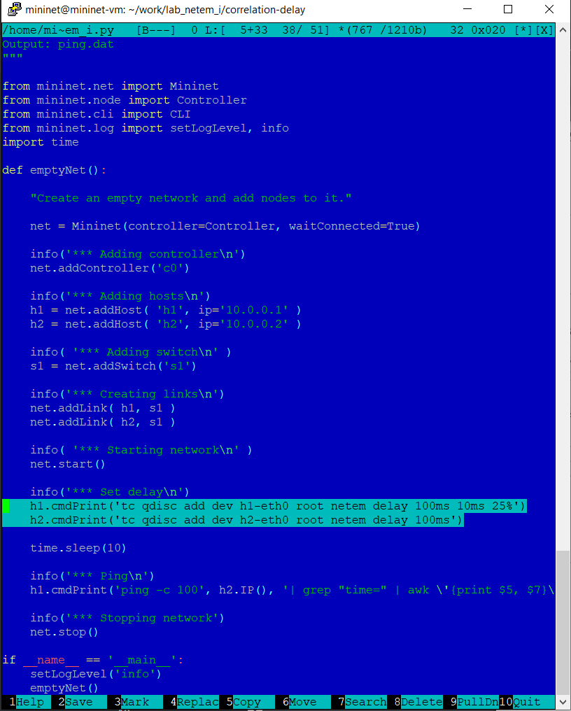{width=100% height=100%}

## Эксперимент по изменению значения корреляции для джиттера и задержки

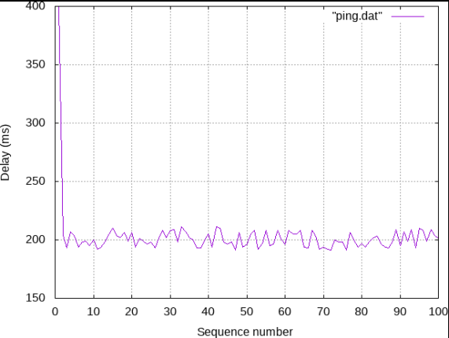{width=100% height=100%}

## Распределения времени задержки в эмулируемой глобальной сети

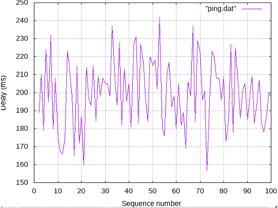{width=100% height=100%}

# Выводы

Мы познакомились с NETEM — инструментом для
тестирования производительности приложений в виртуальной сети, а также получили навыки проведения интерактивного и воспроизводимого экспериментов по измерению задержки и её дрожания (jitter) в моделируемой сети в среде Mininet.

