---
## Front matter
title: "Отчёт по лабораторной работе №4 по дисциплине 

Моделирование сетей передачи данных"
subtitle: "Эмуляция и измерение задержек в глобальных сетях"
author: "Шаповалова Диана Дмитриевна,

НПИбд-02-21, 1032211220"

## Generic otions
lang: ru-RU
toc-title: "Содержание"

## Bibliography
bibliography: bib/cite.bib
csl: pandoc/csl/gost-r-7-0-5-2008-numeric.csl

## Pdf output format
toc: true # Table of contents
toc-depth: 2
lof: true # List of figures
lot: true # List of tables
fontsize: 12pt
linestretch: 1.5
papersize: a4
documentclass: scrreprt
## I18n polyglossia
polyglossia-lang:
  name: russian
  options:
	- spelling=modern
	- babelshorthands=true
polyglossia-otherlangs:
  name: english
## I18n babel
babel-lang: russian
babel-otherlangs: english
## Fonts
mainfont: IBM Plex Serif
romanfont: IBM Plex Serif
sansfont: IBM Plex Sans
monofont: IBM Plex Mono
mathfont: STIX Two Math
mainfontoptions: Ligatures=Common,Ligatures=TeX,Scale=0.94
romanfontoptions: Ligatures=Common,Ligatures=TeX,Scale=0.94
sansfontoptions: Ligatures=Common,Ligatures=TeX,Scale=MatchLowercase,Scale=0.94
monofontoptions: Scale=MatchLowercase,Scale=0.94,FakeStretch=0.9
mathfontoptions:
## Biblatex
biblatex: true
biblio-style: "gost-numeric"
biblatexoptions:
  - parentracker=true
  - backend=biber
  - hyperref=auto
  - language=auto
  - autolang=other*
  - citestyle=gost-numeric
## Pandoc-crossref LaTeX customization
figureTitle: "Рис."
tableTitle: "Таблица"
listingTitle: "Листинг"
lofTitle: "Список иллюстраций"
lotTitle: "Список таблиц"
lolTitle: "Листинги"
## Misc options
indent: true
header-includes:
  - \usepackage{indentfirst}
  - \usepackage{float} # keep figures where there are in the text
  - \floatplacement{figure}{H} # keep figures where there are in the text
---

# Цель работы

Основной целью работы является знакомство с NETEM — инструментом для
тестирования производительности приложений в виртуальной сети, а также
получение навыков проведения интерактивного и воспроизводимого экспериментов по измерению задержки и её дрожания (jitter) в моделируемой сети в среде Mininet.

# Выполнение работы
## Запуск лабораторной топологии
Запустите виртуальную среду с mininet.

Из основной ОС подключитесь к виртуальной машине:

ssh -Y mininet@192.168.x.y

В виртуальной машине mininet при необходимости исправьте права запуска
X-соединения. Скопируйте значение куки (MIT magic cookie)1
своего пользователя mininet в файл для пользователя root

После выполнения этих действий графические приложения должны запускаться под пользователем mininet.

Задайте простейшую топологию, состоящую из двух хостов и коммутатора
с назначенной по умолчанию mininet сетью 10.0.0.0/8:

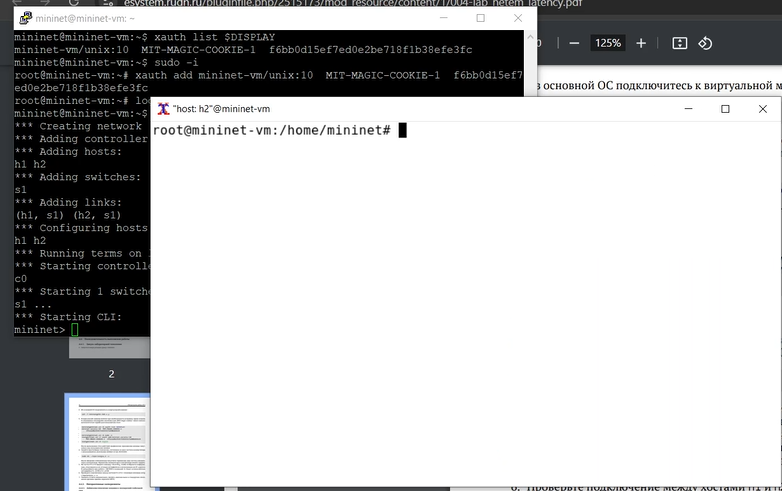{width=100% height=100%}

## Интерактивные эксперименты
## Добавление/изменение задержки в эмулируемой глобальной сети

1. На хосте h1 добавьте задержку в 100 мс к выходному интерфейсу:

sudo tc qdisc add dev h1-eth0 root netem delay 100ms

Здесь:

– sudo: выполнить команду с более высокими привилегиями;

– tc: вызвать управление трафиком Linux;

– qdisc: изменить дисциплину очередей сетевого планировщика;

– add: создать новое правило;

– dev h1-eth0: указать интерфейс, на котором будет применяться правило;

– netem: использовать эмулятор сети;

– delay 100ms: задержка ввода 100 мс.

2. Проверьте, что соединение от хоста h1 к хосту h2 имеет задержку 100 мс,
используя команду ping с параметром -c 6 с хоста h1. Укажите в отчёте
минимальное, среднее, максимальное и стандартное отклонение времени
приёма-передачи (RTT).

3. Для эмуляции глобальной сети с двунаправленной задержкой необходимо
к соответствующему интерфейсу на хосте h2 также добавить задержку в 100
миллисекунд:

sudo tc qdisc add dev h2-eth0 root netem delay 100ms

4. Проверьте, что соединение между хостом h1 и хостом h2 имеет RTT в 200 мс
(100 мс от хоста h1 к хосту h2 и 100 мс от хоста h2 к хосту h1), повторив
команду ping с параметром -c 6 на терминале хоста h1. Укажите в отчёте
минимальное, среднее, максимальное и стандартное отклонение времени
приёма-передачи (RTT).

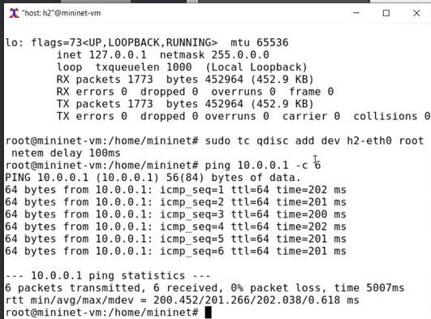{width=100% height=100%}

## Изменение задержки в эмулируемой глобальной сети

1. Измените задержку со 100 мс до 50 мс для отправителя h1:

sudo tc qdisc change dev h1-eth0 root netem delay 50ms

и для получателя h2:

sudo tc qdisc change dev h2-eth0 root netem delay 50ms

2. Проверьте, что соединение от хоста h1 к хосту h2 имеет задержку 100 мс,
используя команду ping с параметром -c 6 с терминала хоста h1. Укажите
в отчёте минимальное, среднее, максимальное и стандартное отклонение
времени приёма-передачи (RTT).

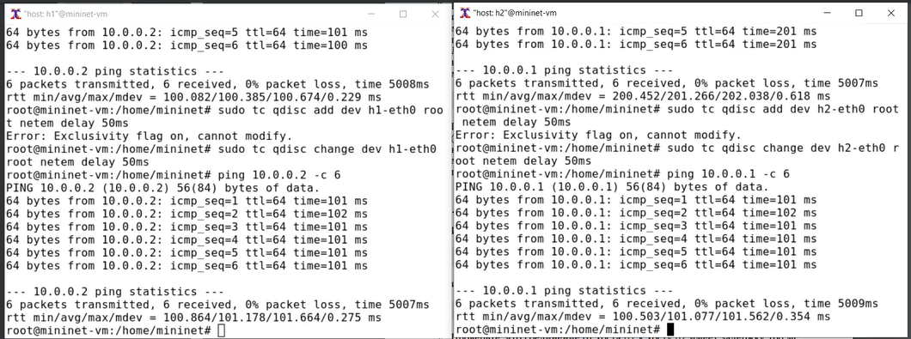{width=100% height=100%}

## Восстановление исходных значений (удаление правил) задержки в эмулируемой глобальной сети

1. Восстановите конфигурацию по умолчанию, удалив все правила, применённые к сетевому планировщику соответствующего интерфейса. Для
отправителя h1:

sudo tc qdisc del dev h1-eth0 root netem

Для получателя h2:

sudo tc qdisc del dev h2-eth0 root netem

2. Проверьте, что соединение между хостом h1 и хостом h2 не имеет явно
установленной задержки, используя команду ping с параметром -c 6 с терминала хоста h1. Укажите в отчёте минимальное, среднее, максимальное
и стандартное отклонение времени приёма-передачи (RTT).

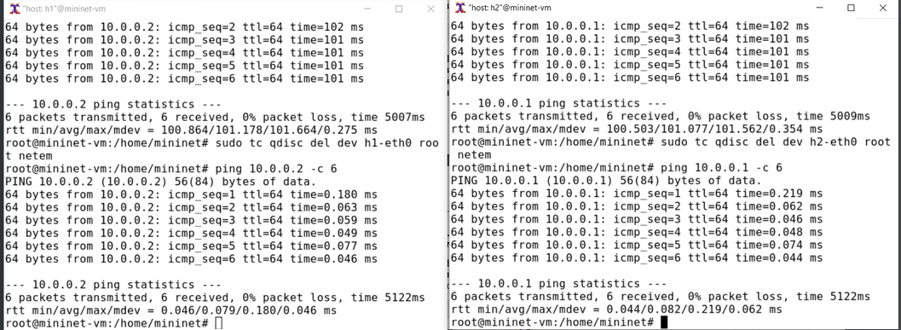{width=100% height=100%}

## Добавление значения дрожания задержки в интерфейс подключения к эмулируемой глобальной сети

В сетях нет постоянной задержки. Она может варьироваться в зависимости
от других потоков трафика, конкурирующих за тот же путь. Джиттер (jitter) —
это изменение времени задержки. Параметры задержки описываются в терминах теории вероятностей средним значением 𝜇, стандартным отклонением
𝜎 и корреляцией. По умолчанию NETEM использует равномерное распределение,
так что задержка находится в пределах 𝜇 ± 𝜎. Параметр корреляции управляет
отношением между последовательными псевдослучайными значениями.
1. При необходимости восстановите конфигурацию интерфейсов по умолчанию
на узлах h1 и h2:

sudo tc qdisc del dev h1-eth0 root netem

sudo tc qdisc del dev h2-eth0 root netem

2. Добавьте на узле h1 задержку в 100 мс со случайным отклонением 10 мс:

sudo tc qdisc add dev h1-eth0 root netem delay 100ms 10ms

3. Проверьте, что соединение от хоста h1 к хосту h2 имеет задержку 100 мс со
случайным отклонением ±10 мс, используя в терминале хоста h1 команду
ping с параметром -c 6. Укажите в отчёте минимальное, среднее, максимальное и стандартное отклонение времени приёма-передачи (RTT).

4. Восстановите конфигурацию интерфейса по умолчанию на узле h1.

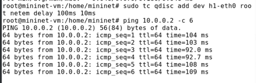{width=100% height=100%}

## Добавление значения корреляции для джиттера и задержки в интерфейс подключения к эмулируемой глобальной сети

1. При необходимости восстановите конфигурацию интерфейсов по умолчанию
на узлах h1 и h2.

2. Добавьте на интерфейсе хоста h1 задержку в 100 мс с вариацией ±10 мс
и значением корреляции в 25%:

sudo tc qdisc add dev h1-eth0 root netem delay 100ms 10ms 25%

3. Убедитесь, что все пакеты, покидающие устройство h1 на интерфейсе h1-
eth0, будут иметь время задержки 100 мс со случайным отклонением ±10 мс,
при этом время передачи следующего пакета зависит от предыдущего значения на 25%. Используйте для этого в терминале хоста h1 команду ping
с параметром -c 20. Укажите в отчёте минимальное, среднее, максимальное
и стандартное отклонение времени приёма-передачи (RTT).

4. Восстановите конфигурацию интерфейса по умолчанию на узле h1.

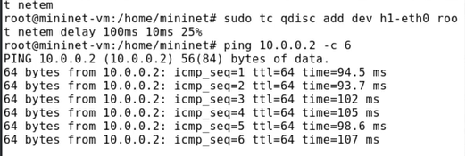{width=100% height=100%}

## Распределение задержки в интерфейсе подключения к эмулируемой глобальной сети

NETEM позволяет пользователю указать распределение, которое описывает,
как задержки изменяются в сети. В реальных сетях передачи данных задержки
неравномерны, поэтому при моделировании может быть удобно использовать
некоторое случайное распределение, например, нормальное, парето или паретонормальное.

1. При необходимости восстановите конфигурацию интерфейсов по умолчанию
на узлах h1 и h2.

2. Задайте нормальное распределение задержки на узле h1 в эмулируемой сети:

sudo tc qdisc add dev h1-eth0 root netem delay 100ms 20ms distribution normal

3. Убедитесь, что все пакеты, покидающие хост h1 на интерфейсе h1-eth0, будут иметь время задержки, которое распределено в диапазоне 100 мс ±20 мс.
Используйте для этого команду ping на терминале хоста h1 с параметром -c 10.

{width=100% height=100%}

4. Восстановите конфигурацию интерфейса по умолчанию на узле h1.

5. Завершите работу mininet в интерактивном режиме, введя в интерфейсе
mininet:

mininet> exit

## Воспроизведение экспериментов
## Предварительная подготовка

1. Обновите репозитории программного обеспечения на виртуальной машине:

sudo apt-get update

2. Установите пакет geeqie — понадобится для просмотра файлов png:

sudo apt install geeqie

3. Для каждого воспроизводимого эксперимента expname создайте свой каталог, в котором будут размещаться файлы эксперимента:

mkdir -p ~/work/lab_netem_i/expname

Здесь expname может принимать значения simple-delay, change-delay,
jitter-delay, correlation-delay и т.п.

4. Для каждого случая создайте скрипт для проведения эксперимента
lab_netem_i.py и скрипт для визуализации результатов ping_plot.

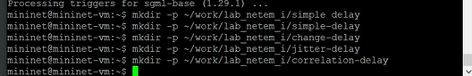{width=100% height=100%}

## Добавление задержки для интерфейса, подключающегося к эмулируемой глобальной сети

С помощью API Mininet воспроизведите эксперимент по добавлению задержки для интерфейса хоста, подключающегося к эмулируемой глобальной сети.

1. В виртуальной среде mininet в своём рабочем каталоге с проектами создайте каталог simple-delay и перейдите в него:

mkdir -p ~/work/lab_netem_i/simple-delay

cd ~/work/lab_netem_i/simple-delay

2. Создаёте скрипт для эксперимента lab_netem_i.py:

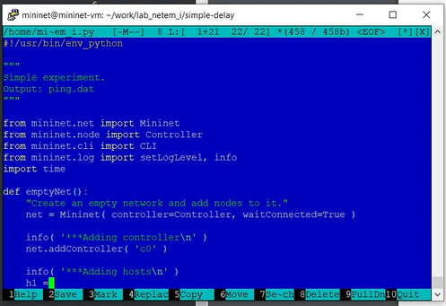{width=100% height=100%}

Создайте скрипт для визуализации ping_plot результатов эксперимента:

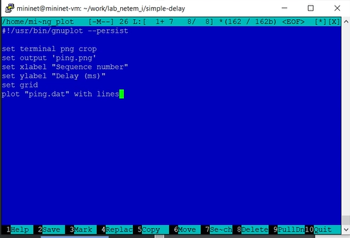{width=100% height=100%}

5. Задайте права доступа к файлу скрипта:

chmod +x ping_plot

6. Создайте Makefile для управления процессом проведения эксперимента

7. Выполните эксперимент:

make

8. Продемонстрируйте построенный в результате выполнения скриптов график.

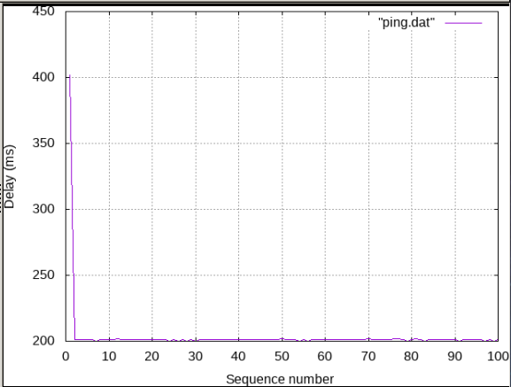{width=100% height=100%}

9. Из файла ping.dat удалите первую строку и заново постройте график:

make ping.png

10. Продемонстрируйте построенный в результате график.

.png){width=100% height=100%}

11. Разработайте скрипт для вычисления на основе данных файла ping.dat минимального, среднего, максимального и стандартного отклонения времени
приёма-передачи. Добавьте правило запуска скрипта в Makefile. Продемонстрируйте работу скрипта с выводом значений на экран или в отдельный
файл.

## Задание для самостоятельной работы

Самостоятельно реализуйте воспроизводимые эксперименты по изменению
задержки, джиттера, значения корреляции для джиттера и задержки, распределения времени задержки в эмулируемой глобальной сети. Постройте графики.
Вычислите минимальное, среднее, максимальное и стандартное отклонение
времени приёма-передачи для каждого случая.

## Эксперимент по изменению задержки

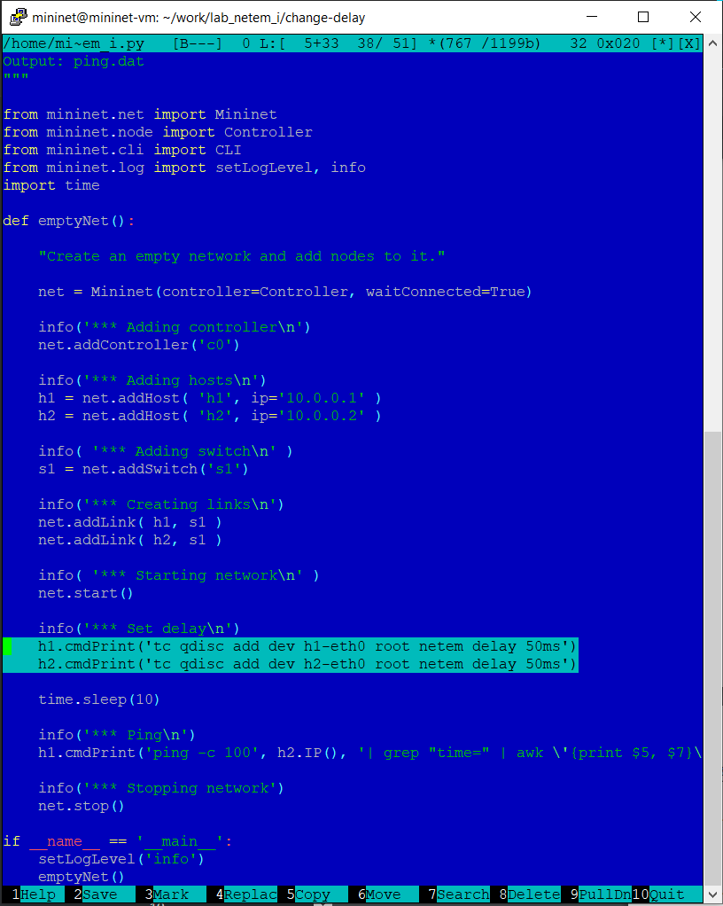{width=100% height=100%}

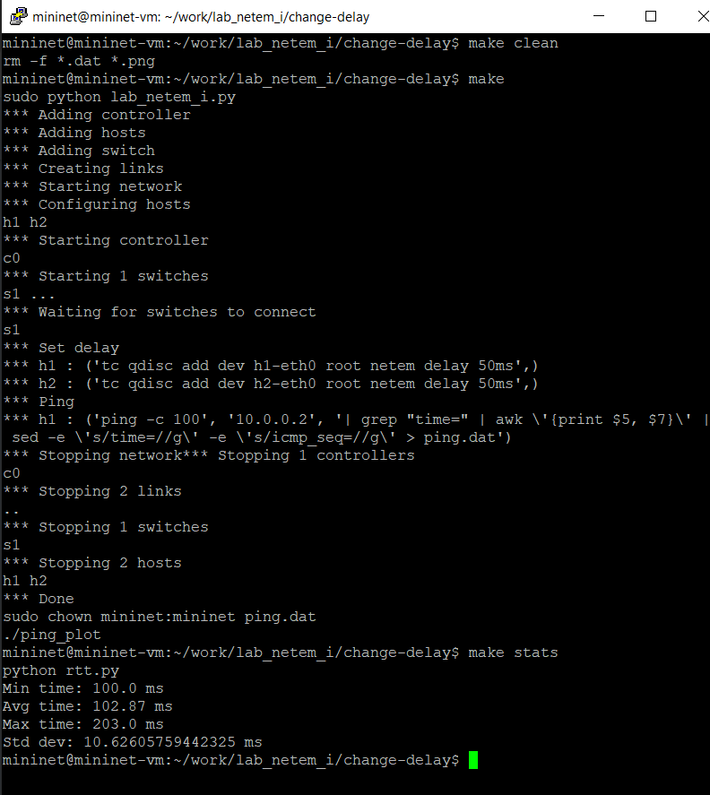{width=100% height=100%}

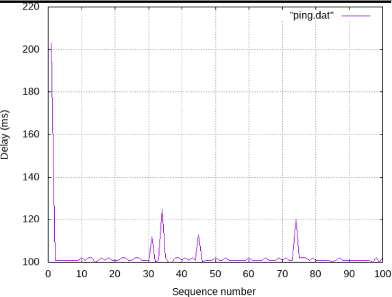{width=100% height=100%}

## Эксперимент по изменению джиттера

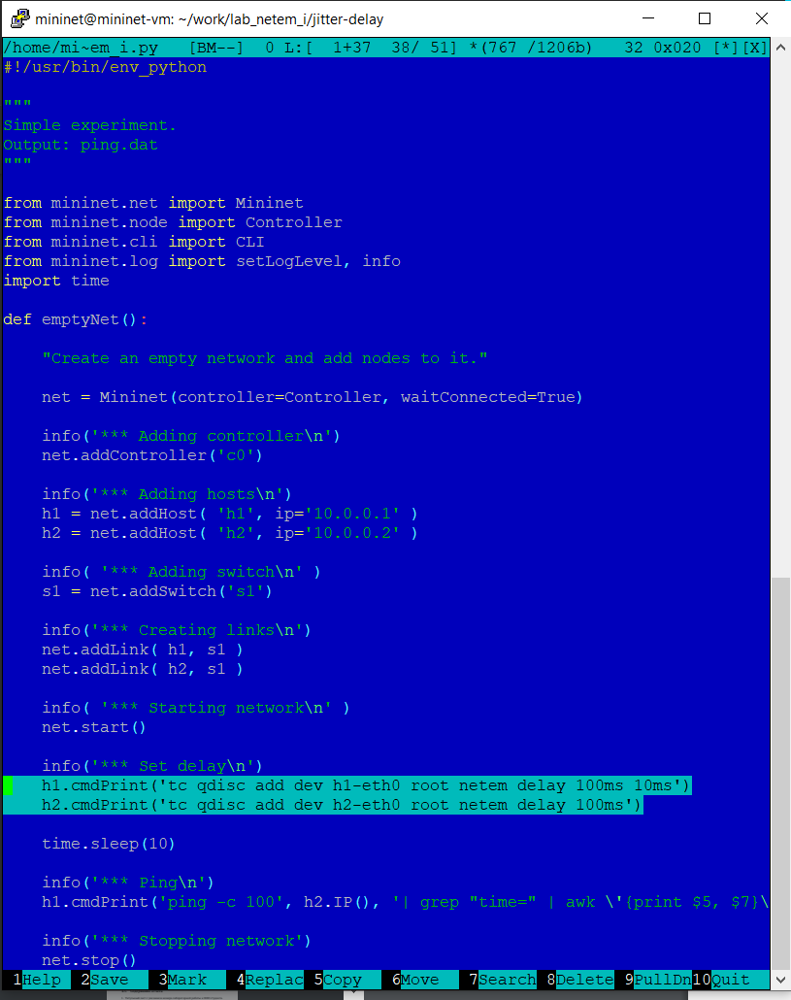{width=100% height=100%}

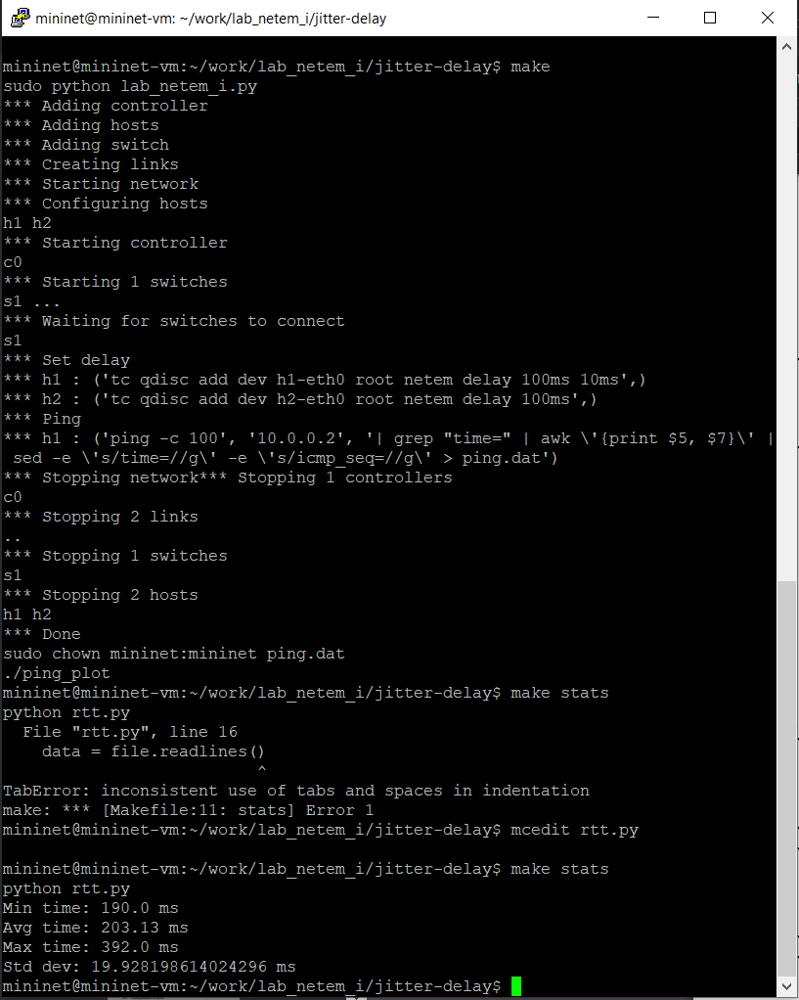{width=100% height=100%}

{width=100% height=100%}

## Эксперимент по изменению значения корреляции для джиттера и задержки

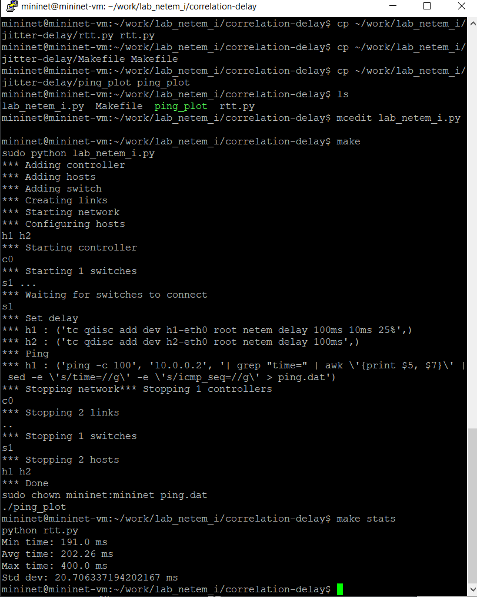{width=100% height=100%}

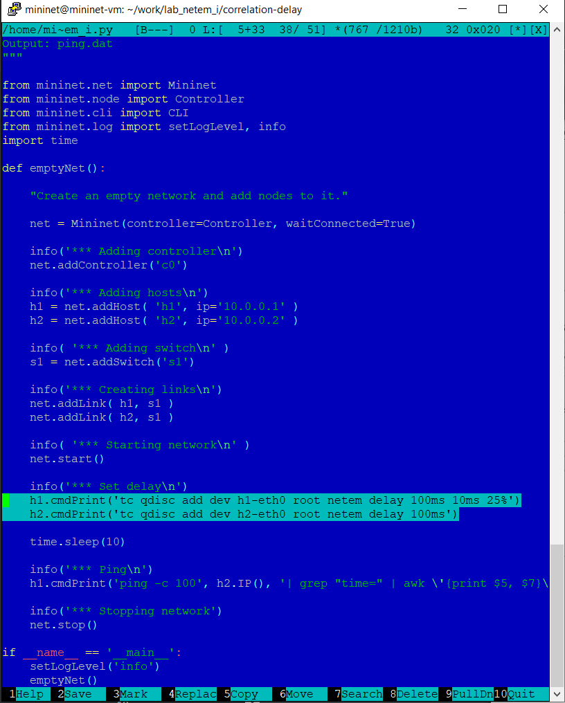{width=100% height=100%}

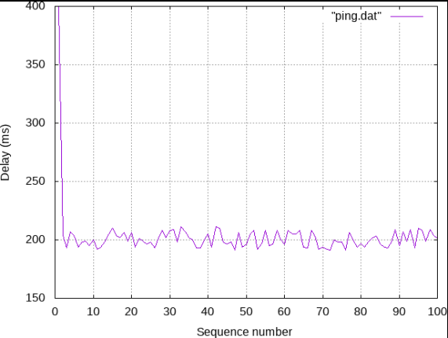{width=100% height=100%}

## Распределения времени задержки в эмулируемой глобальной сети

{width=100% height=100%}

# Выводы

Мы познакомились с NETEM — инструментом для
тестирования производительности приложений в виртуальной сети, а также получили навыки проведения интерактивного и воспроизводимого экспериментов по измерению задержки и её дрожания (jitter) в моделируемой сети в среде Mininet.

# Список литературы

[1] Mininet: https://mininet.org/
