---
## Front matter
lang: ru-RU
title: "Лаб №5 по дисциплине Моделирование сетей передачи данных"
subtitle: Эмуляция и измерение потерь пакетов в глобальных сетях
author:
  - Шаповалова Диана Дмитриевна
institute:
  - Российский университет дружбы народов, Москва, Россия
date: 11 декабря 2024

## i18n babel
babel-lang: russian
babel-otherlangs: english

## Formatting pdf
toc: false
toc-title: Содержание
slide_level: 2
aspectratio: 169
section-titles: true
theme: metropolis
header-includes:
 - \metroset{progressbar=frametitle,sectionpage=progressbar,numbering=fraction}
---

# Вводная часть

## Цель работы

Основной целью работы является получение навыков проведения интерактивных экспериментов в среде Mininet по исследованию параметров сети,
связанных с потерей, дублированием, изменением порядка и повреждением
пакетов при передаче данных. Эти параметры влияют на производительность
протоколов и сетей.

# Выполнение работы

## Интерактивные эксперименты. Добавление потери пакетов на интерфейс, подключённый к эмулируемой глобальной сети

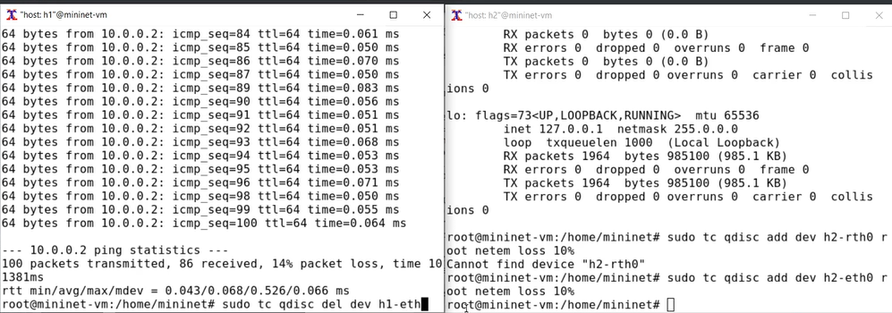{width=100% height=100%}

## Добавление значения корреляции для потери пакетов в эмулируемой глобальной сети

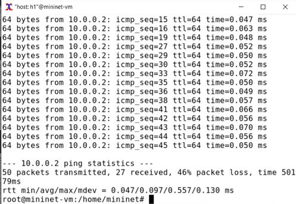{width=100% height=100%}

## Добавление повреждения пакетов в эмулируемой глобальной сети

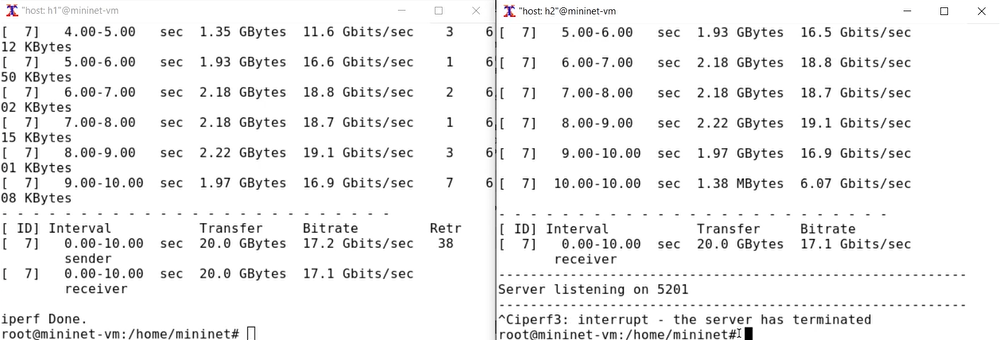{width=100% height=100%}

## Добавление переупорядочивания пакетов в интерфейс подключения к эмулируемой глобальной сети

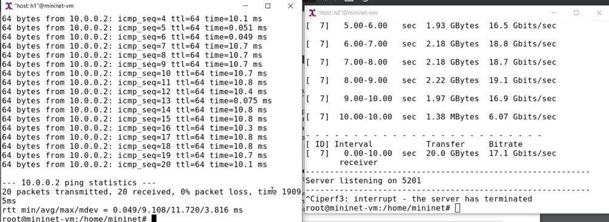{width=100% height=100%}

## Добавление дублирования пакетов в интерфейс подключения к эмулируемой глобальной сети

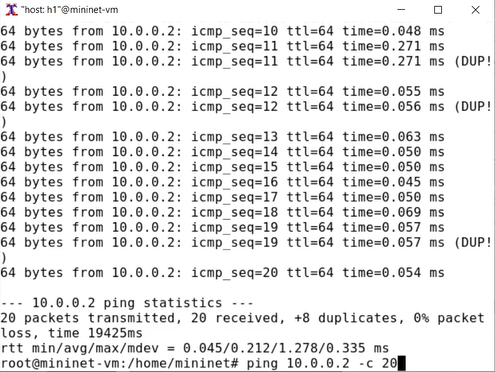{width=100% height=100%}

# Воспроизведение экспериментов

## Предварительная подготовка

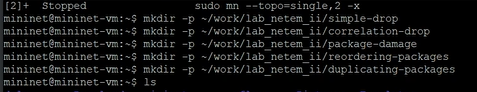{width=100% height=100%}

## Создаем скрипт

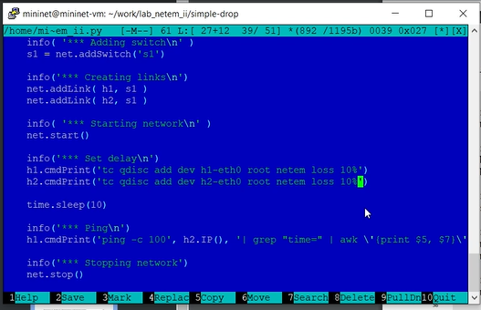{width=100% height=100%}

## Выполняем эксперимент

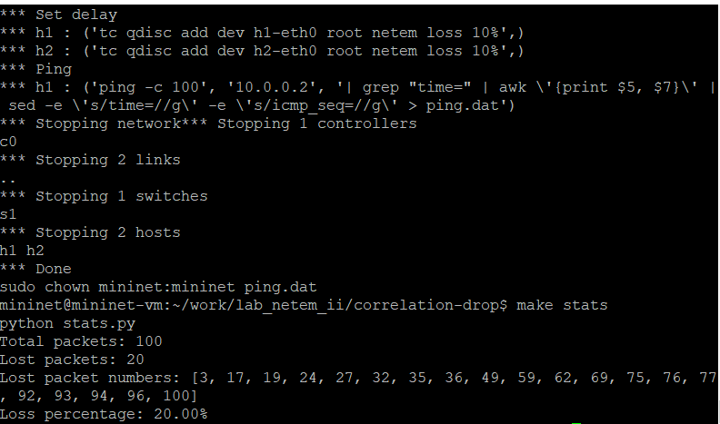{width=100% height=100%}

# Задание для самостоятельной работы

## Самостоятельно реализуйте воспроизводимые эксперименты по исследованию параметров сети, связанных с потерей, изменением порядка
и повреждением пакетов при передаче данных.

{width=100% height=100%}

## Добавление значения корреляции для потери пакетов в эмулируемой глобальной сети

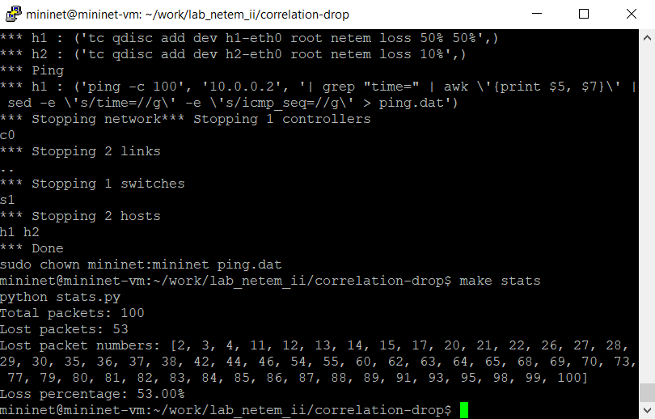{width=100% height=100%}

## Добавление повреждения пакетов в эмулируемой глобальной сети 

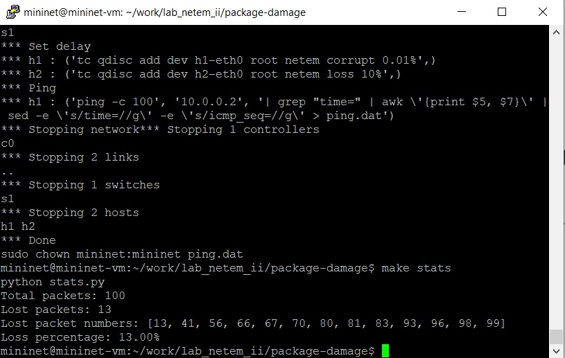{width=100% height=100%}

## Добавление переупорядочивания пакетов в интерфейс подключения к эмулируемой глобальной сети

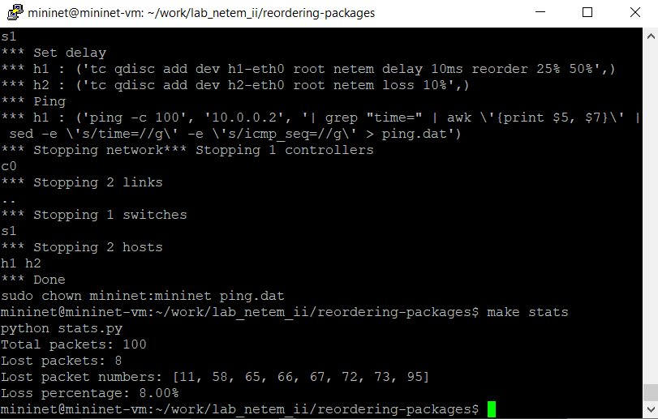{width=100% height=100%}

# Выводы

Мы получили навыки проведения интерактивных экспериментов в среде Mininet по исследованию параметров сети,
связанных с потерей, дублированием, изменением порядка и повреждением
пакетов при передаче данных.
