---
## Front matter
title: "Отчёт по лабораторной работе №5 по дисциплине 

Моделирование сетей передачи данных"
subtitle: "Эмуляция и измерение потерь пакетов в глобальных сетях"
author: "Шаповалова Диана Дмитриевна,

НПИбд-02-21, 1032211220"

## Generic otions
lang: ru-RU
toc-title: "Содержание"

## Bibliography
bibliography: bib/cite.bib
csl: pandoc/csl/gost-r-7-0-5-2008-numeric.csl

## Pdf output format
toc: true # Table of contents
toc-depth: 2
lof: true # List of figures
lot: true # List of tables
fontsize: 12pt
linestretch: 1.5
papersize: a4
documentclass: scrreprt
## I18n polyglossia
polyglossia-lang:
  name: russian
  options:
	- spelling=modern
	- babelshorthands=true
polyglossia-otherlangs:
  name: english
## I18n babel
babel-lang: russian
babel-otherlangs: english
## Fonts
mainfont: IBM Plex Serif
romanfont: IBM Plex Serif
sansfont: IBM Plex Sans
monofont: IBM Plex Mono
mathfont: STIX Two Math
mainfontoptions: Ligatures=Common,Ligatures=TeX,Scale=0.94
romanfontoptions: Ligatures=Common,Ligatures=TeX,Scale=0.94
sansfontoptions: Ligatures=Common,Ligatures=TeX,Scale=MatchLowercase,Scale=0.94
monofontoptions: Scale=MatchLowercase,Scale=0.94,FakeStretch=0.9
mathfontoptions:
## Biblatex
biblatex: true
biblio-style: "gost-numeric"
biblatexoptions:
  - parentracker=true
  - backend=biber
  - hyperref=auto
  - language=auto
  - autolang=other*
  - citestyle=gost-numeric
## Pandoc-crossref LaTeX customization
figureTitle: "Рис."
tableTitle: "Таблица"
listingTitle: "Листинг"
lofTitle: "Список иллюстраций"
lotTitle: "Список таблиц"
lolTitle: "Листинги"
## Misc options
indent: true
header-includes:
  - \usepackage{indentfirst}
  - \usepackage{float} # keep figures where there are in the text
  - \floatplacement{figure}{H} # keep figures where there are in the text
---

# Цель работы

Основной целью работы является получение навыков проведения интерактивных экспериментов в среде Mininet по исследованию параметров сети,
связанных с потерей, дублированием, изменением порядка и повреждением
пакетов при передаче данных. Эти параметры влияют на производительность
протоколов и сетей.

# Выполнение работы
## Запуск лабораторной топологии

Запустите виртуальную среду с mininet.

Из основной ОС подключитесь к виртуальной машине:

ssh -Y mininet@192.168.x.y

В виртуальной машине mininet при необходимости исправьте права запуска
X-соединения. Скопируйте значение куки (MIT magic cookie)1
своего пользователя mininet в файл для пользователя root

После выполнения этих действий графические приложения должны запускаться под пользователем mininet.

Задайте простейшую топологию, состоящую из двух хостов и коммутатора
с назначенной по умолчанию mininet сетью 10.0.0.0/8

## Интерактивные эксперименты
## Добавление потери пакетов на интерфейс, подключённый к эмулируемой глобальной сети

Пакеты могут быть потеряны в процессе передачи из-за таких факторов, как
битовые ошибки и перегрузка сети. Скорость потери данных часто измеряется
как процентная доля потерянных пакетов по отношению к количеству отправленных пакетов.

1. На хосте h1 добавьте 10% потерь пакетов к интерфейсу h1-eth0:

 sudo tc qdisc add dev h1-eth0 root netem loss 10%

Здесь:

– sudo: выполнить команду с более высокими привилегиями;

– tc: вызвать управление трафиком Linux;

– qdisc: изменить дисциплину очередей сетевого планировщика;

– add: создать новое правило;

– dev h1-eth0: указать интерфейс, на котором будет применяться правило;

– netem: использовать эмулятор сети;

– loss 10%: 10% потерь пакетов

2. Проверьте, что на соединении от хоста h1 к хосту h2 имеются потери пакетов, используя команду ping с параметром -c 100 с хоста h1. Параметр -c
указывает общее количество пакетов для отправки. Обратите внимание на
значения icmp_seq. Некоторые номера последовательности отсутствуют изза потери пакетов. В сводном отчёте ping сообщает о проценте потерянных
пакетов после завершения передачи.

3. Для эмуляции глобальной сети с потерей пакетов в обоих направлениях
необходимо к соответствующему интерфейсу на хосте h2 также добавить 10%
потерь пакетов:

sudo tc qdisc add dev h2-eth0 root netem loss 10%

4. Проверьте, что соединение между хостом h1 и хостом h2 имеет больший процент потерянных данных (10% от хоста h1 к хосту h2 и 10% от хоста h2 к хосту
h1), повторив команду ping с параметром -c 100 на терминале хоста h1.
Укажите в отчёте отсутствующие из-за потери пакетов номера последовательности (значения icmp_seq), процент потерянных пакетов после завершения
передачи.

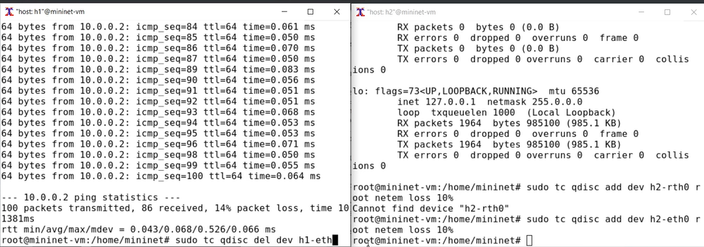{width=100% height=100%}

5. Восстановите конфигурацию по умолчанию, удалив все правила, применённые к сетевому планировщику соответствующего интерфейса. Для
отправителя h1:

sudo tc qdisc del dev h1-eth0 root netem

Для получателя h2:

sudo tc qdisc del dev h2-eth0 root netem

6. Убедитесь, что соединение от хоста h1 к хосту h2 не имеет явной потери
пакетов, запустив команду ping с терминала хоста h1 и затем нажав Ctrl +
c , чтобы остановить тест.

## Добавление значения корреляции для потери пакетов в эмулируемой глобальной сети

1. Добавьте на интерфейсе узла h1 коэффициент потери пакетов 50% (такой
высокий уровень потери пакетов маловероятен), и каждая последующая
вероятность зависит на 50% от последней:

 sudo tc qdisc add dev h1-eth0 root netem loss 50% 50%

2. Проверьте, что на соединении от хоста h1 к хосту h2 имеются потери пакетов,
используя команду ping с параметром -c 50 с хоста h1. Укажите в отчёте
отсутствующие из-за потери пакетов номера последовательности (значения
icmp_seq), процент потерянных пакетов после завершения передачи.

3. Восстановите для узла h1 конфигурацию по умолчанию, удалив все правила,
применённые к сетевому планировщику соответствующего интерфейса:

 sudo tc qdisc del dev h1-eth0 root netem

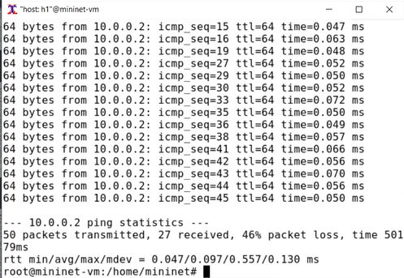{width=100% height=100%}

## Добавление повреждения пакетов в эмулируемой глобальной сети

1. При необходимости восстановите конфигурацию интерфейсов по умолчанию
на узлах h1 и h2.

2. Добавьте на интерфейсе узла h1 0,01% повреждения пакетов:

sudo tc qdisc add dev h1-eth0 root netem corrupt 0.01%

3. Проверьте конфигурацию с помощью инструмента iPerf3 для проверки
повторных передач. Для этого:

– запустите iPerf3 в режиме сервера в терминале хоста h2:

iperf3 -s

– запустите iPerf3 в клиентском режиме в терминале хоста h1:

iperf3 -c 10.0.0.2

– В отчёте отразите значения повторной передачи на каждом временном
интервале и общее количество повторно переданных пакетов.

– Для остановки сервера iPerf3 нажмите Ctrl + c в терминале хоста h2.

4. Восстановите для узла h1 конфигурацию по умолчанию, удалив все правила,
применённые к сетевому планировщику соответствующего интерфейса.

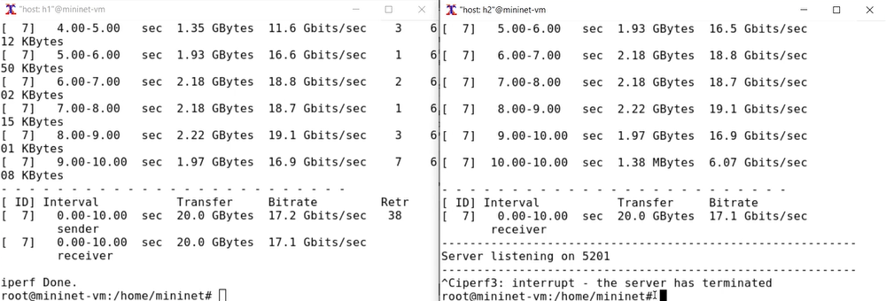{width=100% height=100%}

## Добавление переупорядочивания пакетов в интерфейс подключения к эмулируемой глобальной сети

1. При необходимости восстановите конфигурацию интерфейсов по умолчанию
на узлах h1 и h2.

2. Добавьте на интерфейсе узла h1 следующее правило:

sudo tc qdisc add dev h1-eth0 root netem delay 10ms reorder 25% 50%

Здесь 25% пакетов (со значением корреляции 50%) будут отправлены немедленно, а остальные 75% будут задержаны на 10 мс.

3. Проверьте, что на соединении от хоста h1 к хосту h2 имеются потери пакетов,
используя команду ping с параметром -c 20 с хоста h1. Убедитесь, что часть
пакетов не будут иметь задержки (один из четырех, или 25%), а последующие несколько пакетов будут иметь задержку около 10 миллисекунд (три
из четырех, или 75%). При необходимости повторите тест. Укажите в отчёте
отсутствующие из-за потери пакетов номера последовательности (значения
icmp_seq), процент потерянных пакетов после завершения передачи.

4. Восстановите конфигурацию интерфейса по умолчанию на узле h1.

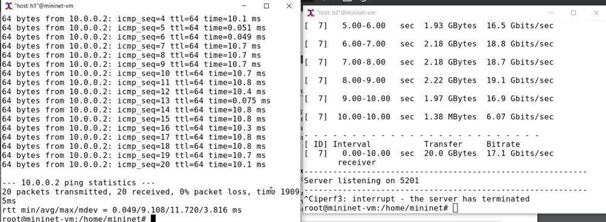{width=100% height=100%}

## Добавление дублирования пакетов в интерфейс подключения к эмулируемой глобальной сети

1. При необходимости восстановите конфигурацию интерфейсов по умолчанию
на узлах h1 и h2.

2. Для интерфейса узла h1 задайте правило c дублированием 50% пакетов (т.е.
50% пакетов должны быть получены дважды):

sudo tc qdisc add dev h1-eth0 root netem duplicate 50%

3. Проверьте, что на соединении от хоста h1 к хосту h2 имеются дублированные
пакеты, используя команду ping с параметром -c 20 с хоста h1. Дубликаты
пакетов помечаются как DUP!. Измеренная скорость дублирования пакетов
будет приближаться к настроенной скорости по мере выполнения большего
количества попыток.

4. Восстановите конфигурацию интерфейса по умолчанию на узле h1.

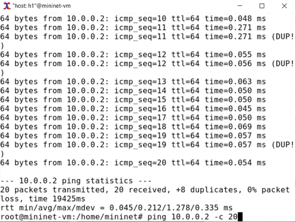{width=100% height=100%}

# Воспроизведение экспериментов
## Предварительная подготовка

1. Для каждого воспроизводимого эксперимента expname создайте свой каталог, в котором будут размещаться файлы эксперимента:

 mkdir -p ~/work/lab_netem_ii/expname

Здесь expname может принимать значения simple-drop, correlationdrop и т.п.

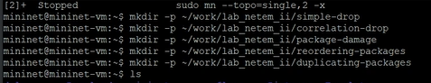{width=100% height=100%}

2. Для каждого случая создайте скрипт для проведения эксперимента
lab_netem_ii.py.

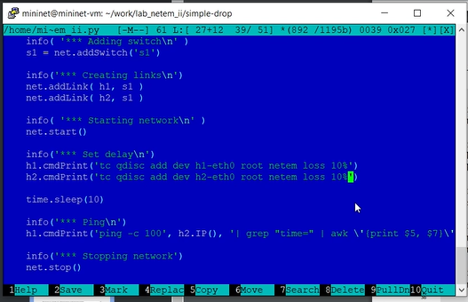{width=100% height=100%}

Выполните эксперимент:

 make

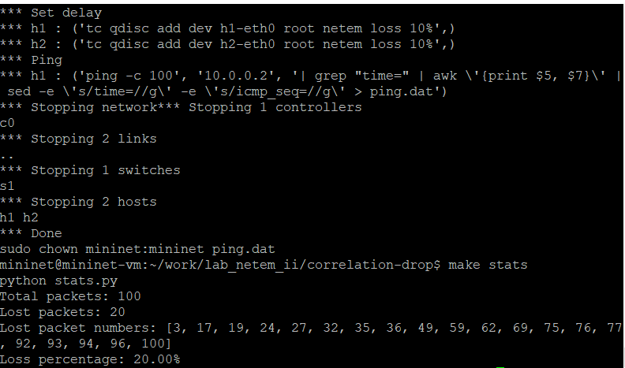{width=100% height=100%}

## Задание для самостоятельной работы

Самостоятельно реализуйте воспроизводимые эксперименты по исследованию параметров сети, связанных с потерей, изменением порядка
и повреждением пакетов при передаче данных.

{width=100% height=100%}

Добавление значения корреляции для потери пакетов в эмулируемой глобальной сети

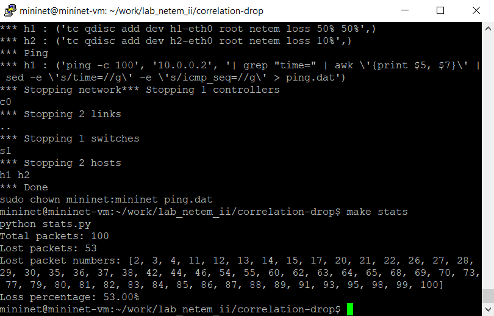{width=100% height=100%}

Добавление повреждения пакетов в эмулируемой глобальной сети 

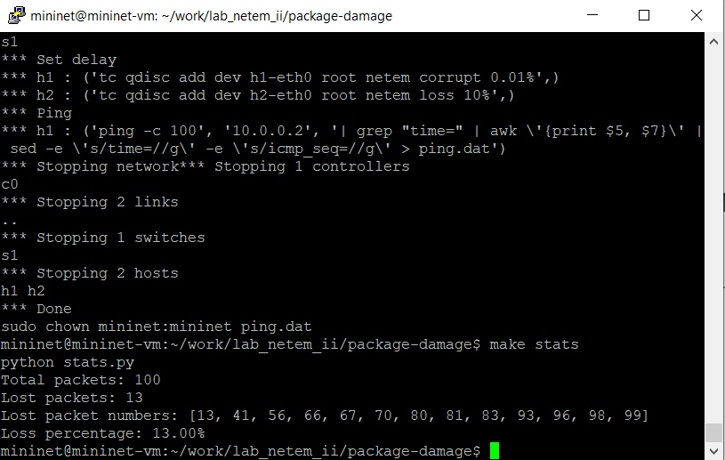{width=100% height=100%}

Добавление переупорядочивания пакетов в интерфейс подключения к эмулируемой глобальной сети

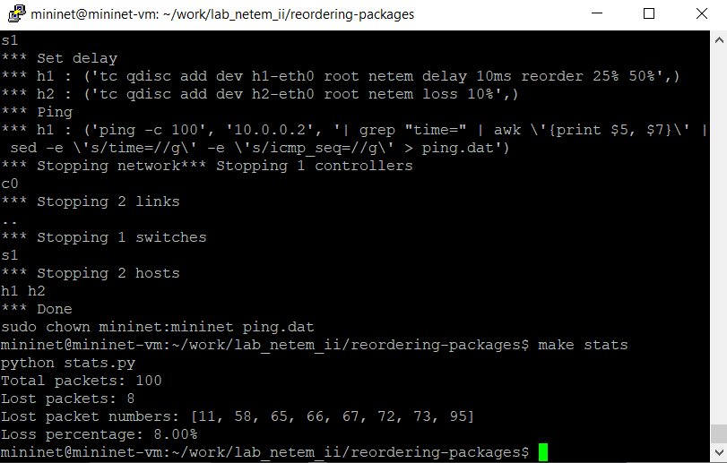{width=100% height=100%}

# Выводы

Мы получили навыки проведения интерактивных экспериментов в среде Mininet по исследованию параметров сети,
связанных с потерей, дублированием, изменением порядка и повреждением
пакетов при передаче данных.

# Список литературы

[1] Mininet: https://mininet.org/
