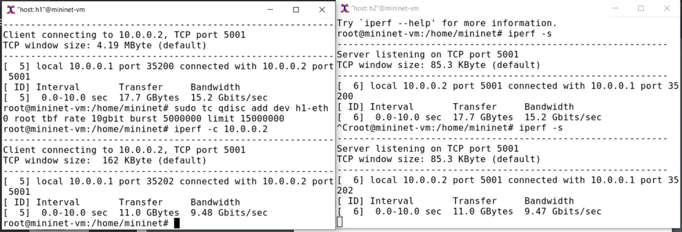
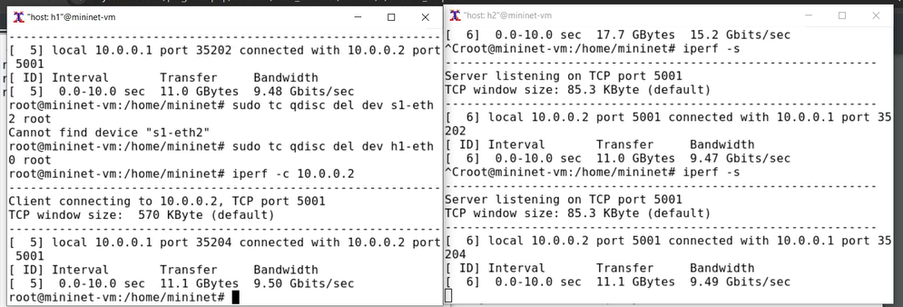
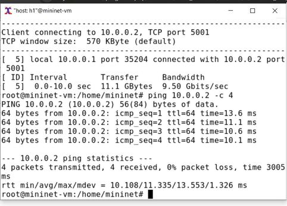
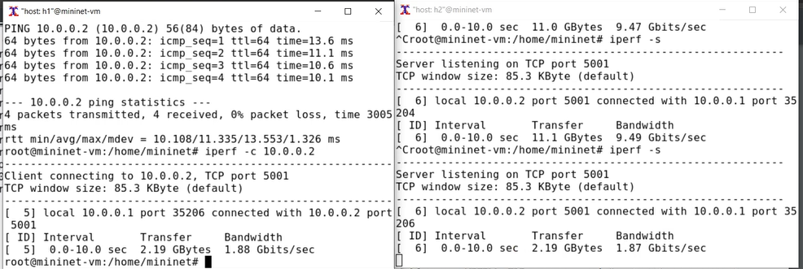
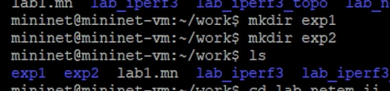
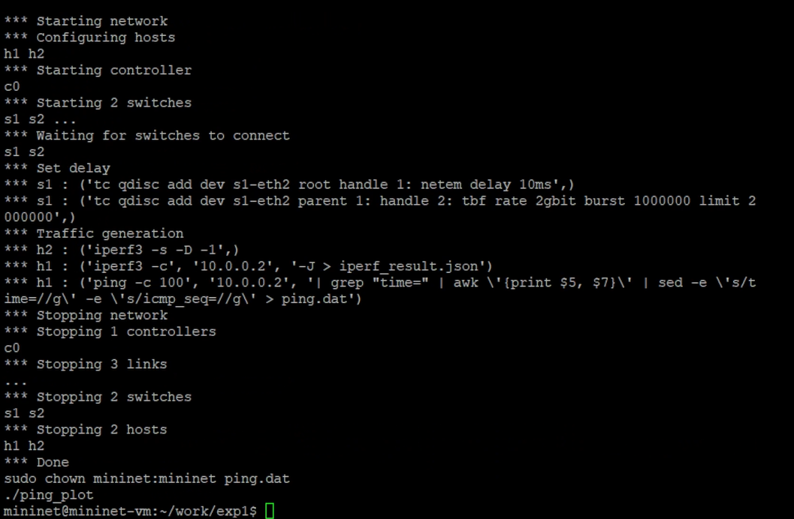
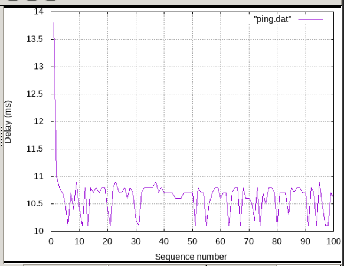
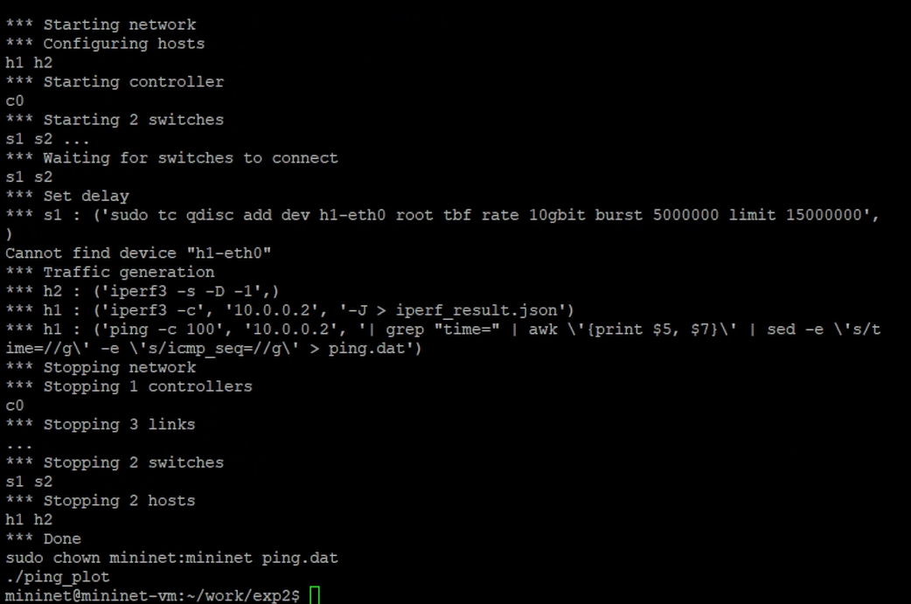
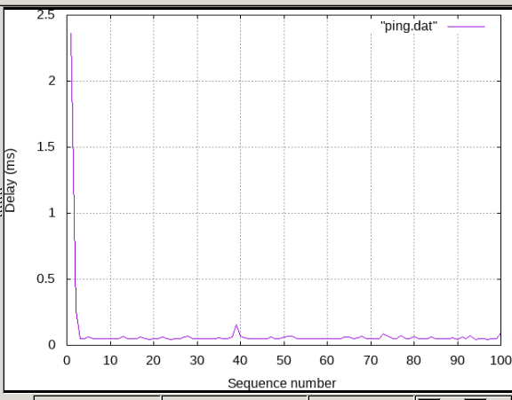

---
## Front matter
lang: ru-RU
title: "Лаб №6 по дисциплине Моделирование сетей передачи данных"
subtitle: Настройка пропускной способности глобальной сети с помощью Token Bucket Filter
author:
  - Шаповалова Диана Дмитриевна
institute:
  - Российский университет дружбы народов, Москва, Россия
date: 19 декабря 2024

## i18n babel
babel-lang: russian
babel-otherlangs: english

## Formatting pdf
toc: false
toc-title: Содержание
slide_level: 2
aspectratio: 169
section-titles: true
theme: metropolis
header-includes:
 - \metroset{progressbar=frametitle,sectionpage=progressbar,numbering=fraction}
---

# Вводная часть

## Цель работы

Основной целью работы является знакомство с принципами работы дисциплины очереди Token Bucket Filter, которая формирует входящий/исходящий
трафик для ограничения пропускной способности, а также получение навыков
моделирования и исследования поведения трафика посредством проведения
интерактивного и воспроизводимого экспериментов в Mininet.

# Выполнение работы

## Интерактивные эксперименты. Ограничение скорости на конечных хостах

{width=100% height=100%}

## Ограничение скорости на коммутаторах

{width=100% height=100%}

## Объединение NETEM и TBF

{width=100% height=100%}

## Объединение NETEM и TBF

{width=100% height=100%}

## Воспроизводимые эксперименты

{width=100% height=100%}

## Воспроизводимые эксперименты

{width=100% height=100%}

## Воспроизводимые эксперименты

{width=100% height=100%}

## Воспроизводимые эксперименты

{width=100% height=100%}

## Воспроизводимые эксперименты

{width=100% height=100%}

# Выводы

Я познакомилась с принципами работы дисциплины очереди Token Bucket Filter, которая формирует входящий/исходящий
трафик для ограничения пропускной способности, а также получила навыки
моделирования и исследования поведения трафика посредством проведения интерактивного и воспроизводимого экспериментов в Mininet.

