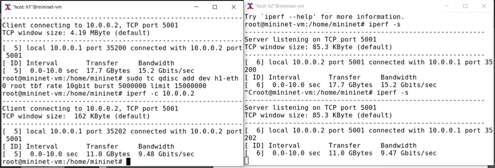
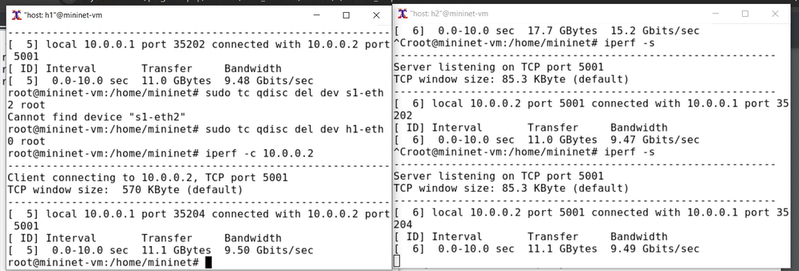
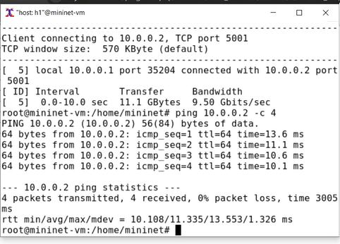
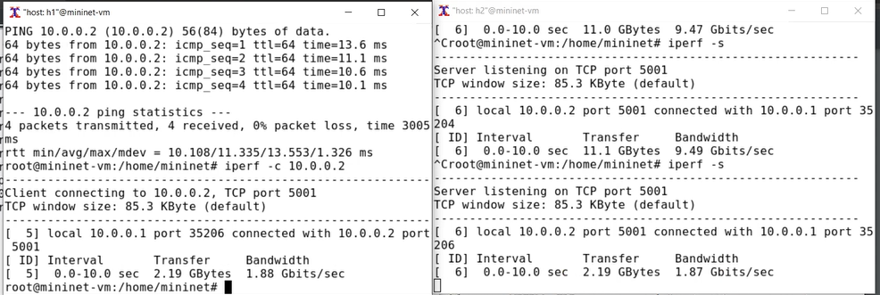
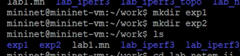
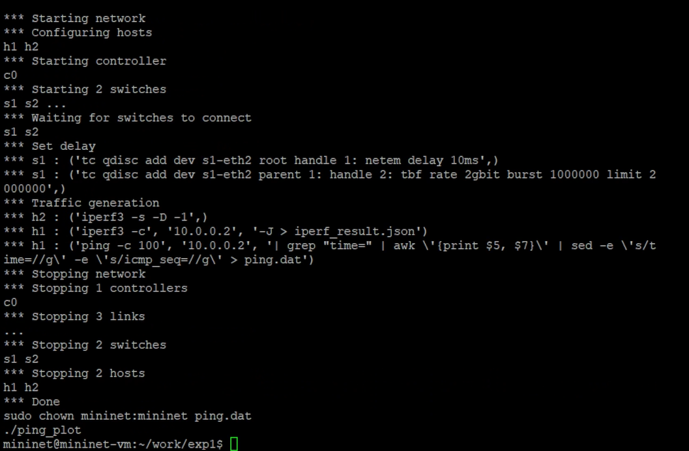
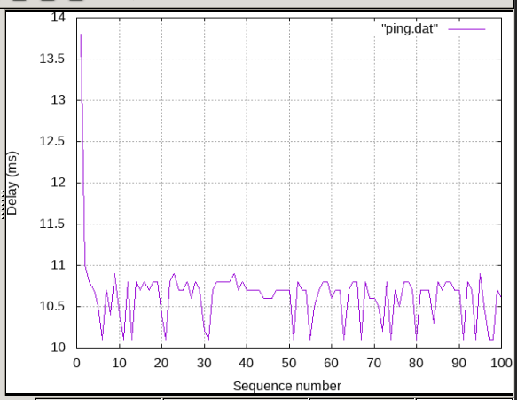
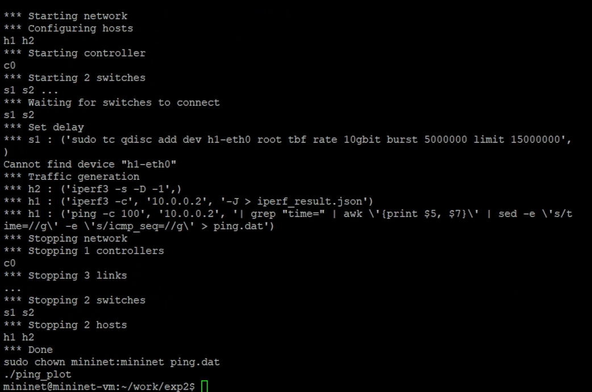
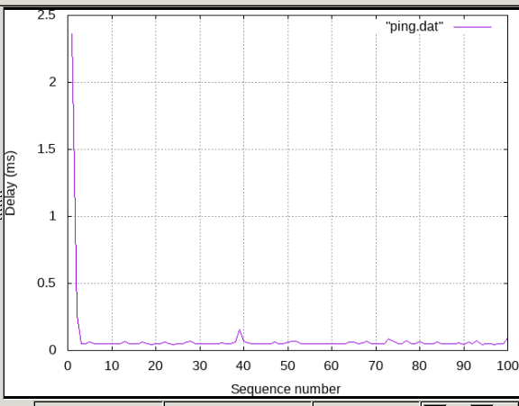

---
## Front matter
title: "Отчёт по лабораторной работе №6 по дисциплине 

Моделирование сетей передачи данных"
subtitle: "Настройка пропускной способности глобальной сети с помощью Token Bucket Filter"
author: "Шаповалова Диана Дмитриевна,

НПИбд-02-21, 1032211220"

## Generic otions
lang: ru-RU
toc-title: "Содержание"

## Bibliography
bibliography: bib/cite.bib
csl: pandoc/csl/gost-r-7-0-5-2008-numeric.csl

## Pdf output format
toc: true # Table of contents
toc-depth: 2
lof: true # List of figures
lot: true # List of tables
fontsize: 12pt
linestretch: 1.5
papersize: a4
documentclass: scrreprt
## I18n polyglossia
polyglossia-lang:
  name: russian
  options:
	- spelling=modern
	- babelshorthands=true
polyglossia-otherlangs:
  name: english
## I18n babel
babel-lang: russian
babel-otherlangs: english
## Fonts
mainfont: IBM Plex Serif
romanfont: IBM Plex Serif
sansfont: IBM Plex Sans
monofont: IBM Plex Mono
mathfont: STIX Two Math
mainfontoptions: Ligatures=Common,Ligatures=TeX,Scale=0.94
romanfontoptions: Ligatures=Common,Ligatures=TeX,Scale=0.94
sansfontoptions: Ligatures=Common,Ligatures=TeX,Scale=MatchLowercase,Scale=0.94
monofontoptions: Scale=MatchLowercase,Scale=0.94,FakeStretch=0.9
mathfontoptions:
## Biblatex
biblatex: true
biblio-style: "gost-numeric"
biblatexoptions:
  - parentracker=true
  - backend=biber
  - hyperref=auto
  - language=auto
  - autolang=other*
  - citestyle=gost-numeric
## Pandoc-crossref LaTeX customization
figureTitle: "Рис."
tableTitle: "Таблица"
listingTitle: "Листинг"
lofTitle: "Список иллюстраций"
lotTitle: "Список таблиц"
lolTitle: "Листинги"
## Misc options
indent: true
header-includes:
  - \usepackage{indentfirst}
  - \usepackage{float} # keep figures where there are in the text
  - \floatplacement{figure}{H} # keep figures where there are in the text
---

# Цель работы

Основной целью работы является знакомство с принципами работы дисциплины очереди Token Bucket Filter, которая формирует входящий/исходящий
трафик для ограничения пропускной способности, а также получение навыков
моделирования и исследования поведения трафика посредством проведения
интерактивного и воспроизводимого экспериментов в Mininet.

# Выполнение работы
## Запуск лабораторной топологии

1. Запустите виртуальную среду с mininet.

2. Из основной ОС подключитесь к виртуальной машине:

3. В виртуальной машине mininet при необходимости исправьте права запуска
X-соединения. Скопируйте значение куки (MIT magic cookie)1
своего пользователя mininet в файл для пользователя root:

После выполнения этих действий графические приложения должны запускаться под пользователем mininet.

4. Задайте топологию сети, состоящую из двух хостов и двух коммутаторов
с назначенной по умолчанию mininet сетью 10.0.0.0/8:

sudo mn --topo=linear,2 -x

## Интерактивные эксперименты
## Ограничение скорости на конечных хостах

Команду tc можно применить к сетевому интерфейсу устройства для формирования исходящего трафика. Требуется ограничить скорость отправки данных
с конечного хоста с помощью фильтра Token Bucket Filter (tbf).

1. Измените пропускную способность хоста h1, установив пропускную способность на 10 Гбит/с на интерфейсе h1-eth0 и параметры TBF-фильтра:

sudo tc qdisc add dev h1-eth0 root tbf rate 10gbit burst 5000000 limit 15000000

Здесь:

– sudo: включить выполнение команды с более высокими привилегиями
безопасности;

– tc: вызвать управление трафиком Linux;

– qdisc: изменить дисциплину очередей сетевого планировщика;

– add (добавить): создать новое правило;

– dev h1-eth0 root: интерфейс, на котором будет применяться правило;

– tbf: использовать алгоритм Token Bucket Filter;

– rate: указать скорость передачи (10 Гбит/с);

– burst: количество байтов, которое может поместиться в корзину (5 000 000);

– limit: размер очереди в байтах (15 000 000).

С помощью iPerf3 проверьте, что значение пропускной способности изменилось:

– В терминале хоста h2 запустите iPerf3 в режиме сервера:

iperf3 -s

– В терминале хоста h2 запустите iPerf3 в режиме клиента:

iperf3 -c 10.0.0.2

– После завершения работы iPerf3 на хосте h1 остановите iPerf3 на хосте
h2, нажав Ctrl + c . В отчёте зафиксируйте результат отработки iPerf3 на
данном этапе проведения эксперимента.

{width=100% height=100%}

## Ограничение скорости на коммутаторах

При ограничении скорости на интерфейсе s1-eth2 коммутатора s1 все сеансы связи между коммутатором s1 и коммутатором s2 будут фильтроваться
в соответствии с применяемыми правилами.

1. Примените правило ограничения скорости tbf с параметрами rate = 10gbit,
burst = 5,000,000, limit= 15,000,000 к интерфейсу s1-eth2 коммутатора s1,
который соединяет его с коммутатором s2:

sudo tc qdisc add dev s1-eth2 root tbf rate 10gbit burst 5000000 limit 15000000

2. Проверьте конфигурацию с помощью инструмента iperf3 для измерения
пропускной способности:

– В терминале хоста h2 запустите iPerf3 в режиме сервера:

iperf3 -s

– В терминале хоста h2 запустите iPerf3 в режиме клиента:

iperf3 -c 10.0.0.2

– После завершения работы iPerf3 на хосте h1 остановите iPerf3 на хосте
h2, нажав Ctrl + c . В отчёте зафиксируйте результат отработки iPerf3 на
данном этапе проведения эксперимента.

{width=100% height=100%}

## Объединение NETEM и TBF

NETEM используется для изменения задержки, джиттера, повреждения пакетов и т.д. TBF может использоваться для ограничения скорости. Утилита tc
позволяет комбинировать несколько модулей. При этом первая дисциплина
очереди (qdisc1) присоединяется к корневой метке, последующие дисциплины
очереди можно прикрепить к своим родителям, указав правильную метку.

1. Объедините NETEM и TBF, введя на интерфейсе s1-eth2 коммутатора s1
задержку, джиттер, повреждение пакетов и указав скорость:

sudo tc qdisc add dev s1-eth2 root handle 1: netem delay 10ms

Здесь ключевое слово handle задаёт дескриптор подключения, имеющий
смысл очерёдности подключения разных дисциплин qdisc.

2. Убедитесь, что соединение от хоста h1 к хосту h2 имеет заданную задержку.
Для этого запустите команду ping с параметром -c 4 с терминала хоста h1.

{width=100% height=100%}

4. Добавьте второе правило на коммутаторе s1, которое задаёт ограничение скорости с помощью tbf с параметрами rate=2gbit, burst=1,000,000,
limit=2,000,000:

sudo tc qdisc add dev s1-eth2 parent 1: handle 2: tbf rate 2gbit burst 1000000 limit 2000000

5. Проверьте конфигурацию с помощью инструмента iperf3 для измерения
пропускной способности:

– В терминале хоста h2 запустите iPerf3 в режиме сервера:

iperf3 -s

– В терминале хоста h2 запустите iPerf3 в режиме клиента:

iperf3 -c 10.0.0.2

– После завершения работы iPerf3 на хосте h1 остановите iPerf3 на хосте
h2, нажав Ctrl + c . В отчёте зафиксируйте результат отработки iPerf3 на
данном этапе проведения эксперимента.

{width=100% height=100%}

## Воспроизводимые эксперименты

Самостоятельно реализуйте воспроизводимые эксперименты по использованию TBF для ограничения пропускной способности. Постройте соответствующие
графики.

1. Для каждого эксперимента создала каталог

{width=100% height=100%}

Создала скрипты lab.py, Makefile, ping_plot

Объединение NETEM и TBF 

{width=100% height=100%}

{width=100% height=100%}

Ограничение скорости на коммутаторах

{width=100% height=100%}

{width=100% height=100%}

# Выводы

Я познакомилась с принципами работы дисциплины очереди Token Bucket Filter, которая формирует входящий/исходящий
трафик для ограничения пропускной способности, а также получила навыки
моделирования и исследования поведения трафика посредством проведения интерактивного и воспроизводимого экспериментов в Mininet.

# Список литературы

[1] Mininet: https://mininet.org/
